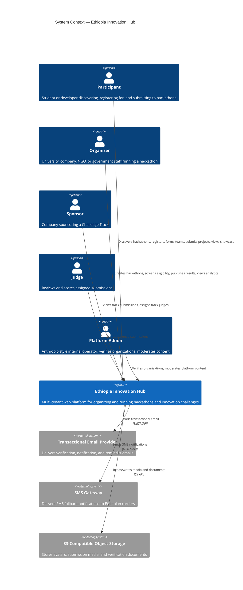
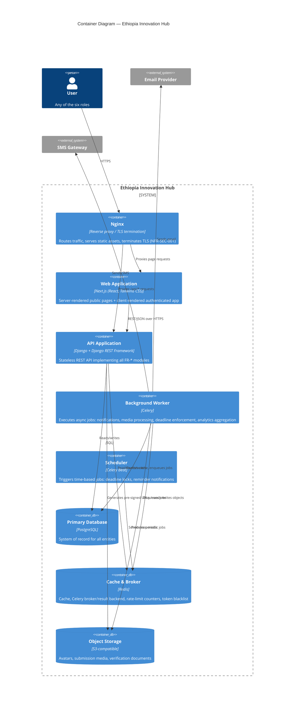
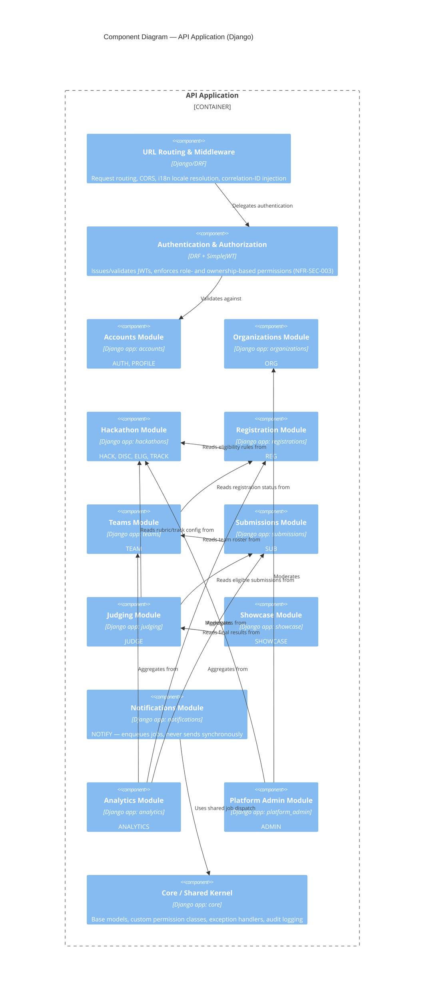
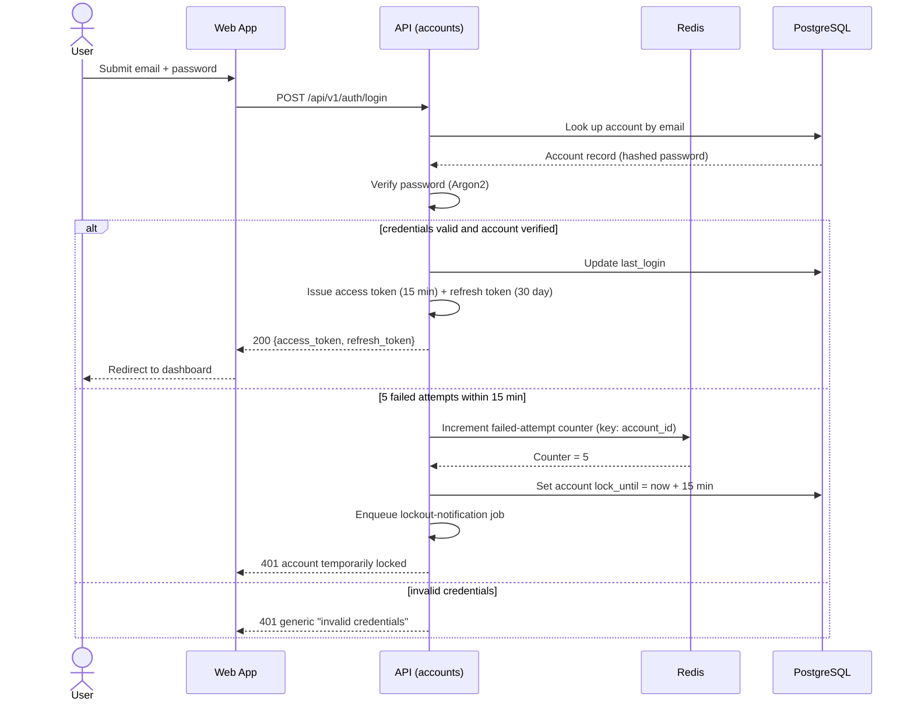
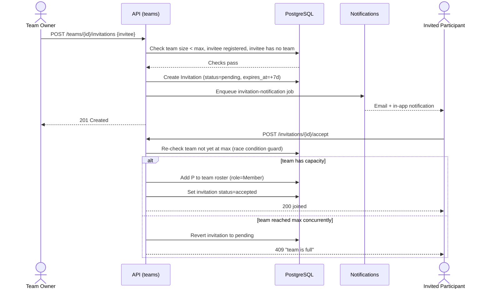
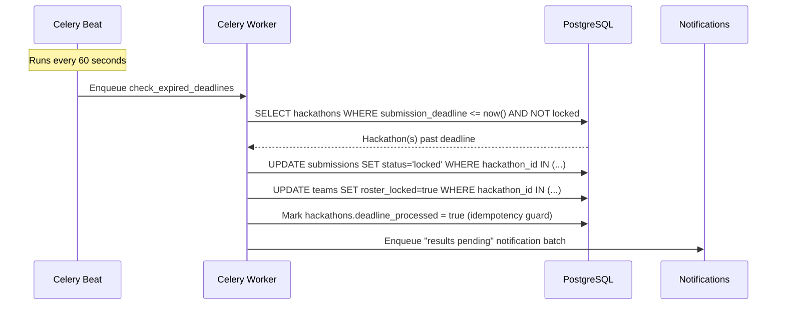
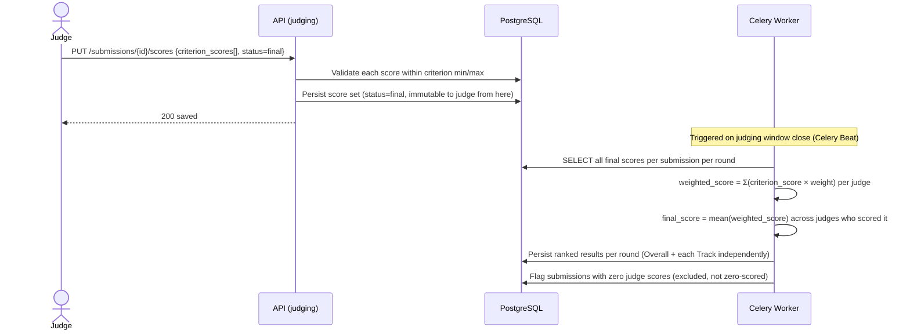
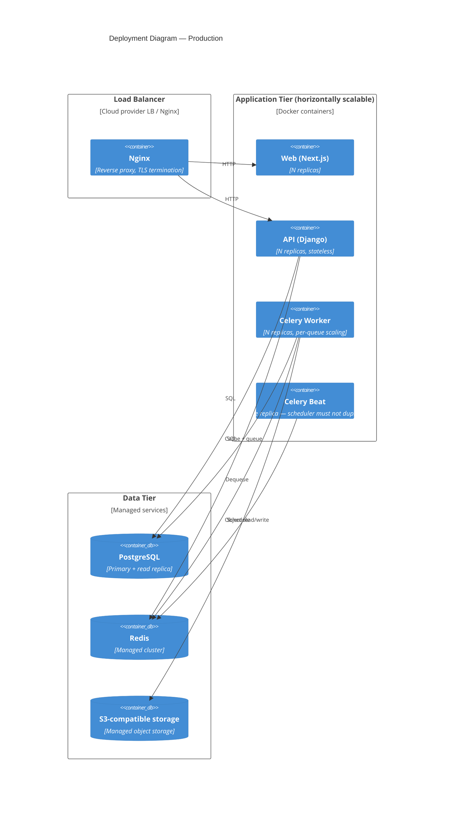
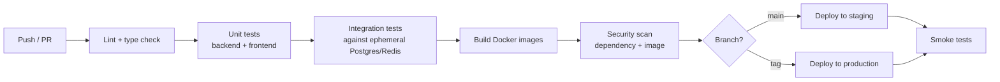

# 03 — Software Design Specification

**Document type:** Software Design Specification (SDS)
**Audience:** Software architects, backend engineers, frontend engineers, DevOps engineers, technical reviewers
**Status:** Complete — derived from and traceable to the SRS
**Related documents:** [02 — Software Requirements Specification](02-software-requirements-specification.md) (source of truth this document implements) · [04 — API Specification](04-openapi-specification.yaml) (endpoint-level contract) · [05 — Database Design](05-database-design.md) (schema-level detail) · [08 — Deployment and DevOps](08-deployment-and-devops.md) (operational detail)

---

## 1. Introduction

### 1.1 Purpose

This document specifies **how** the Ethiopia Innovation Hub is built. Every design decision in this document exists to satisfy one or more requirements defined in [Document 02](02-software-requirements-specification.md). Where a requirement changes, this document changes with it; where this document introduces a capability, that capability must trace back to a requirement ID. No new product behavior is introduced here — only the architecture, components, and mechanisms that implement behavior already specified.

### 1.2 Scope

This document covers system architecture, the component/module decomposition of the backend and frontend, authentication and authorization design, caching and storage architecture, background job design, deployment topology, and the cross-cutting concerns (logging, rate limiting, internationalization, error handling) needed to satisfy the non-functional requirements in [Document 02, Section 5](02-software-requirements-specification.md#5-non-functional-requirements). Endpoint-level API contracts are specified in [Document 04](04-openapi-specification.yaml); table-level schema detail is specified in [Document 05](05-database-design.md); this document is the layer between them — the architecture that both must conform to.

### 1.3 Design principles

Four principles govern every decision in this document, each directly traceable to a constraint in [Document 02, Section 2.4](02-software-requirements-specification.md#24-constraints) or the MVP philosophy in [Document 01](01-product-overview.md):

1. **Boring technology, deliberately.** Every component is a well-understood, widely-documented technology chosen so a small team can operate it without specialist hires. Novelty is not a goal.
2. **Modular monolith over microservices.** A single deployable backend, internally decomposed into clearly bounded modules, is faster to build, easier to reason about, and cheaper to operate for a small team than a distributed system — while still allowing modules to be extracted later if a specific one outgrows the monolith (see ADR-001).
3. **Stateless application tier.** No backend process holds session or request state in memory; all state lives in PostgreSQL, Redis, or object storage. This is what makes NFR-SCALE-001 (horizontal scaling) achievable without a redesign.
4. **Every asynchronous side effect is a named, retryable job.** Sending an email, resizing an avatar, or locking a submission at deadline is never performed inline in a request/response cycle; it is dispatched to a background worker so that a slow or failed side effect never blocks a user-facing request (this is what makes NFR-PERF-001 achievable even though FR-NOTIFY-001 and BR-003 are triggered by user actions and by time).

---

## 2. Architectural Overview (C4 Model)

### 2.1 Level 1 — System Context



**Note on roles:** the `Mentor` role is a defined account type per [Document 02, Section 1.4](02-software-requirements-specification.md#14-roles-referenced-in-this-document), but no MVP functional requirement module grants it capabilities beyond the ones already available to any authenticated account (profile, discovery). Mentor-specific workflows (structured mentor-mentee matching, office-hours scheduling) are Phase 2 scope — see [Document 09](09-project-roadmap.md) — and are intentionally absent from this architecture.

A **local payment aggregator** and **Fayda Digital ID** are explicitly not system actors in this diagram: per [Document 02, Section 2.3](02-software-requirements-specification.md#23-assumptions-and-dependencies), both are deferred external dependencies with no MVP integration point.

### 2.2 Level 2 — Container Diagram



Every container is independently deployable and independently scalable. The **API Application** and **Background Worker** share the same Django codebase and models but run as separate container processes so that a spike in async job volume (e.g., a mass deadline-reminder dispatch) never competes with user-facing API request handling for CPU or connection-pool capacity — a direct design response to NFR-PERF-001 and NFR-AVAIL-003.

### 2.3 Level 3 — Component Diagram (API Application)



Each component in this diagram is a Django app with the same fixed internal layering, described in Section 3.

---

## 3. Backend Module Design

### 3.1 Layering convention

Every Django app in this system follows the same four-layer internal structure, so that any engineer familiar with one module can immediately navigate any other:

| Layer | File(s) | Responsibility |
|---|---|---|
| `models.py` | ORM models | Data shape and database-level constraints only. No business logic. |
| `services.py` | Plain Python functions/classes | All business logic and cross-model orchestration (e.g., "invite a team member" spans validation, model writes, and notification dispatch). This is the layer that enforces business rules from [Document 02, Section 4](02-software-requirements-specification.md#4-business-rules). |
| `serializers.py` | DRF serializers | Request/response shape and field-level validation only. Delegates to `services.py` for anything stateful. |
| `views.py` | DRF viewsets/views | HTTP concerns only: routing to a service call, permission checks, and response status codes. |

This separation exists so that acceptance criteria expressed as business behavior (e.g., FR-TEAM-002's 7-day invitation expiry) are unit-testable against `services.py` directly, without spinning up HTTP requests — supporting the 80% coverage target in NFR-MAINT-001.

### 3.2 Module-to-requirement mapping

| Django app | FR modules implemented | Depends on |
|---|---|---|
| `accounts` | AUTH, PROFILE | `core` |
| `organizations` | ORG | `accounts`, `core` |
| `hackathons` | HACK, DISC, ELIG, TRACK | `organizations` |
| `registrations` | REG | `hackathons`, `accounts` |
| `teams` | TEAM | `registrations` |
| `submissions` | SUB | `teams` |
| `judging` | JUDGE | `submissions`, `hackathons` |
| `showcase` | SHOWCASE | `judging`, `accounts` |
| `notifications` | NOTIFY | `core` (consumed by every other module) |
| `analytics` | ANALYTICS | `registrations`, `teams`, `submissions` |
| `platform_admin` | ADMIN | `organizations`, `hackathons` |
| `core` | Shared kernel (audit log, base permissions, i18n helpers) | none |

Localization (I18N) is not a separate Django app; it is implemented as a cross-cutting concern (Section 6.4) applied to every module's serializers and to the frontend, since language is a property of *how* every module responds, not a bounded domain of its own.

### 3.3 Multi-tenancy design

Per [Document 02, Section 2.1](02-software-requirements-specification.md#21-product-perspective), the platform is multi-tenant at the *hackathon* and *organization* level, not at the database level. **Row-level scoping** is used rather than schema-per-tenant or database-per-tenant: every tenant-scoped model (hackathons, registrations, teams, submissions, judging assignments) carries a foreign key to its owning `Organization` and/or `Hackathon`, and every queryset in `services.py` is required to filter by that key before returning data. This is enforced structurally by a `TenantScopedManager` base class in `core` that raises at import-time (not silently) if a tenant-scoped model's default manager does not declare a scoping field — turning a whole class of cross-tenant data leaks (the failure mode BR-009 exists to prevent) into a startup-time error rather than a runtime bug. See ADR-004 for the rationale against schema-per-tenant.

---

## 4. Authentication and Authorization Design

### 4.1 Authentication mechanism

The platform uses **stateless JWT authentication** (`djangorestframework-simplejwt`), directly implementing FR-AUTH-002:

- **Access token:** 15-minute expiry, carried in the `Authorization: Bearer` header on every API request. Contains `user_id`, `token_version`, and `issued_at` claims. Contains no role or permission claims — roles are always re-checked against the database on each request, so a role revoked mid-session cannot be exercised until the access token naturally expires (worst case: 15 minutes), and can be forced out immediately via `token_version` invalidation (Section 4.3).
- **Refresh token:** 30-day expiry, stored by the client and exchanged for a new access token via a dedicated endpoint. Refresh tokens are rotated on every use (a used refresh token is immediately invalidated) to satisfy NFR-SEC-005 without requiring server-side session storage for every access token.

### 4.2 Sequence — login and token issuance (FR-AUTH-002)



### 4.3 Authorization model (RBAC, tenant-scoped)

Authorization is enforced **server-side, on every state-changing endpoint**, independent of any client-provided role claim — this is the literal implementation of NFR-SEC-003. The model has two tiers:

1. **Global roles:** only `Platform Admin` is global. Stored as a boolean flag on the account, checked by a single `IsPlatformAdmin` DRF permission class used across the `platform_admin` app.
2. **Scoped roles:** `Organizer`, `Sponsor`, `Judge`, `Mentor` are rows in a `RoleAssignment` table (`user_id`, `role`, `scope_type` [`organization`|`hackathon`|`track`], `scope_id`). A request handler resolves "does this user hold role X for this specific resource" by querying `RoleAssignment`, never by trusting a token claim. `Participant` is the implicit default role of any authenticated, non-elevated user and has no `RoleAssignment` row.

This design is what makes BR-009 ("a Sponsor may access only submissions opted into their assigned track") and FR-TEAM-005's access check enforceable as a single reusable permission class (`HasScopedRole`) rather than bespoke logic per view, satisfying NFR-SEC-003's requirement for an authorization test against *every* FR with an access-control acceptance criterion.

**Immediate session revocation** (FR-AUTH-004, NFR-SEC-005): each account carries a `token_version` integer. Password reset, explicit logout-all-devices, and admin-initiated suspension all increment `token_version`. Every access token's `token_version` claim is checked against the current database value on each request; a mismatch is rejected with 401 even though the JWT itself has not expired — this is how a stateless token scheme still achieves immediate, individually-revocable sessions without server-side session storage for access tokens.

---

## 5. Key Interaction Design (Sequence Diagrams)

### 5.1 Team invitation and acceptance (FR-TEAM-002, FR-TEAM-003)



The race-condition guard is a `SELECT ... FOR UPDATE` on the team row inside a single database transaction, so two concurrent acceptances cannot both pass the capacity check — this is the concrete mechanism behind FR-TEAM-003's stated race-condition acceptance criterion.

### 5.2 Deadline enforcement — submission lock (BR-003, FR-SUB-003)



Server time is authoritative for every deadline check (never client time), satisfying FR-REG-001 and FR-SUB-003's server-authoritative acceptance criteria. The `deadline_processed` flag makes the job idempotent: if Celery Beat fires the check twice for the same minute (at-least-once delivery), the second run is a no-op.

### 5.3 Judging and result calculation (FR-JUDGE-002, FR-JUDGE-003)



Overall and Track rounds are calculated as fully independent aggregations over disjoint or overlapping judge pools (FR-JUDGE-004); the worker task is parameterized by round ID and never shares state across rounds, so a Track result cannot mathematically influence an Overall result.

---

## 6. Cross-Cutting Design Concerns

### 6.1 Background job design (async architecture)

Every job below exists specifically to keep a user-facing request fast (NFR-PERF-001) by moving non-critical-path work off the request/response cycle:

| Job | Triggered by | Satisfies |
|---|---|---|
| `send_transactional_email` | Any NOTIFY-triggering event | FR-NOTIFY-001, NFR-PERF-003 |
| `send_sms_fallback` | Deadline reminder, results-published events | FR-NOTIFY-002 |
| `resize_avatar` | Avatar upload | FR-PROFILE-003 |
| `check_expired_deadlines` | Celery Beat, every 60 seconds | BR-002, BR-003, FR-SUB-003 |
| `send_deadline_reminder` | Celery Beat, 24h before submission deadline | FR-NOTIFY-001 |
| `calculate_judging_results` | Judging window close | FR-JUDGE-003 |
| `aggregate_analytics` | Celery Beat, every 5 minutes | FR-ANALYTICS-001, FR-ANALYTICS-002 |
| `process_org_verification_docs` | Document upload (virus-scan + thumbnailing) | FR-ORG-003 |

All jobs are retried automatically (exponential backoff, 5 attempts) on transient failure (e.g., email provider timeout) and log a structured failure event on final exhaustion rather than failing silently — the mechanism behind NFR-AVAIL-003's dependency-isolation requirement: an SMS gateway outage causes `send_sms_fallback` jobs to retry and eventually dead-letter, but never blocks `send_transactional_email` or any synchronous API endpoint, because they run in fully independent queues (Section 6.2).

### 6.2 Caching and queue design (Redis)

Redis serves three distinct purposes, isolated into separate logical databases so that a spike in one never starves another:

| Redis DB index | Purpose | Example keys |
|---|---|---|
| 0 | Celery broker + result backend, split into `notifications`, `media`, `analytics`, `scheduled` queues | — |
| 1 | Application cache: discovery catalog listings (FR-DISC-001/002), public hackathon detail pages (FR-DISC-003) | `discovery:catalog:page:{n}:{filters_hash}` |
| 2 | Rate-limit counters and login-attempt counters | `ratelimit:login:{account_id}`, `ratelimit:search:{admin_id}` |

Discovery cache entries are invalidated on hackathon publish, unpublish, or timeline edit (FR-HACK-002, FR-HACK-005) rather than left to expire on a fixed TTL, so organizers never see stale status on their own dashboard while participants still get the performance benefit of a warm cache — the mechanism satisfying NFR-PERF-002's 1-second discovery response target at catalog scale.

### 6.3 Object storage design (S3-compatible)

| Prefix | Contents | Access pattern |
|---|---|---|
| `avatars/{user_id}/` | Resized profile images (FR-PROFILE-003) | Public read, authenticated write via pre-signed URL |
| `submissions/{hackathon_id}/{team_id}/` | Submission media (FR-SUB-002) | Public read once showcase is published; authenticated-team read otherwise |
| `org-verification/{organization_id}/` | Manual verification documents (FR-ORG-003) | Private; readable only by `Platform Admin` via short-lived pre-signed URL |

Uploads never pass through the Django API process as a full file body for anything above avatar size; the API issues a pre-signed upload URL and the client uploads directly to object storage, with the API only persisting the resulting object key. This keeps the API application stateless and its request-handling latency unaffected by upload size or client bandwidth, which matters directly for NFR-USE-002 (3G-network usability).

### 6.4 Internationalization implementation (I18N)

FR-I18N-001 and FR-I18N-002 are implemented at two layers:

- **Backend:** Django's built-in `gettext`-based i18n framework provides translated strings for any platform-authored text returned by the API (validation error messages, notification templates). The active locale is resolved per-request from an `Accept-Language`-equivalent custom header set by the frontend, or from the authenticated user's stored `language_preference` field when present — never from a cookie alone, since NFR-L10N-002 requires the preference to follow an authenticated user across devices.
- **Frontend:** Next.js `next-intl`, with English and Amharic message catalogs maintained as versioned JSON files reviewed in the same pull request as any UI copy change, enforcing NFR-L10N-001's "both languages before ship" requirement at review time rather than as a post-hoc audit.

User-generated content (hackathon descriptions, submission text) is stored and rendered exactly as authored, untranslated, per FR-I18N-001 — the platform performs no machine translation of user content in MVP.

### 6.5 Error handling and API response contract

Every error response across every module shares one envelope shape, defined once in `core` and used by a global DRF exception handler:

```json
{
  "error": {
    "code": "VALIDATION_ERROR",
    "message": "Human-readable, localized message",
    "field_errors": { "bio": "Must be 500 characters or fewer" }
  }
}
```

This is what allows the frontend to implement NFR-USE-003 (inline, field-adjacent validation display) generically once, rather than per-form, and is why every acceptance criterion in Document 02 that specifies an HTTP status code (401, 403, 404, 409) can be verified with one shared contract test rather than a bespoke assertion per endpoint.

### 6.6 Observability

- **Structured logging:** every log line is JSON with a `correlation_id` (generated at the Nginx layer and propagated through every downstream service call, including into Celery job payloads), so a single user-facing request and every async job it triggers can be traced end-to-end.
- **Audit logging:** every action referenced by an SRS acceptance criterion as "recorded" or "logged" (FR-ELIG-001 disqualification reasons, FR-ADMIN-001 moderation actions, FR-ADMIN-002 admin searches, FR-JUDGE-001 reassignments) is written to a single append-only `AuditLog` table in `core`, never to application logs alone, since audit records must outlive log rotation and must be queryable (per FR-ADMIN-001's "retained indefinitely for audit purposes").
- **Metrics:** request latency, error rate, and queue depth are exported in Prometheus format from both the API and worker containers; see [Document 08](08-deployment-and-devops.md) for the monitoring stack that consumes them.

### 6.7 Rate limiting

Rate limiting is implemented as DRF throttle classes backed by Redis DB 2 (Section 6.2), applied at three distinct points already specified as behavior in Document 02, rather than as a single global limiter:

- Login attempts: 5 per 15 minutes per account (FR-AUTH-002).
- Verification email resend: 1 per 5 minutes per account (FR-AUTH-003).
- Platform Admin search: logged per query, not hard-rate-limited, but monitored for anomalous volume (FR-ADMIN-002).

---

## 7. Frontend Architecture

### 7.1 Structure

The frontend is a single Next.js application with two rendering strategies, chosen per route based on its access pattern:

| Route category | Rendering strategy | Rationale |
|---|---|---|
| Public discovery, hackathon detail, showcase, public profile | Server-side rendered (SSR) with incremental revalidation | Unauthenticated, SEO-relevant, must load fast on 3G (NFR-USE-002, NFR-PERF-004) |
| Authenticated dashboards (participant, organizer, judge, sponsor, admin) | Client-side rendered (CSR) behind auth guard | Highly interactive, no SEO requirement, avoids unnecessary server load for private data |

### 7.2 State management

Server state (hackathons, teams, submissions — anything owned by the API) is managed with a data-fetching/cache library (e.g., React Query) rather than global client state, so that cache invalidation follows the API as the single source of truth. Local UI state (form inputs, modal visibility, language toggle before persistence) uses React's built-in state. No client-side state is treated as authoritative for anything a business rule in Document 02 governs — every write goes through the API, and the API's response is what the UI trusts.

### 7.3 Component organization

Components are organized by the same module boundaries as the backend (`features/auth`, `features/hackathons`, `features/teams`, `features/submissions`, etc.) so that a frontend engineer working on, say, FR-TEAM-002 can locate both the API contract and the UI in a predictably mirrored location. Shared presentational primitives (buttons, form fields, the language toggle) live in a `components/ui` directory with no feature-specific logic, per the design-system approach detailed in [Document 06](06-ui-ux-specification.md).

---

## 8. Deployment Architecture

### 8.1 Container topology



The **API** and **Web** containers are stateless and horizontally scaled behind the load balancer to satisfy NFR-SCALE-001. **Celery Beat runs as exactly one replica** by design — it is a scheduler, and running two would duplicate every periodic job (e.g., double-sending deadline reminders); Celery Workers, by contrast, scale freely since jobs are idempotent or safely retryable (Section 6.1).

### 8.2 Environments

Three environments share the same container images, differing only by configuration and data: `development` (local Docker Compose, seeded fixture data), `staging` (mirrors production topology at reduced scale, used for organizer and QA acceptance testing before a pilot hackathon), and `production`. Promotion between environments is image-based, not rebuild-based — the exact image tested in staging is the one deployed to production, per the CI/CD design in [Document 08](08-deployment-and-devops.md).

### 8.3 CI/CD pipeline (GitHub Actions)



A failing stage blocks progression to the next; production deployment additionally requires a manual approval gate. This pipeline is the enforcement mechanism for NFR-MAINT-001 (coverage threshold checked at the unit-test stage) and NFR-SEC-004 (dependency/image scan gate).

---

## 9. Architecture Decision Records

### ADR-001: Modular monolith over microservices

**Decision:** Build one deployable Django application, internally decomposed into bounded Django apps, rather than separate services per module.
**Rationale:** The MVP philosophy (Document 01) explicitly requires the system to be buildable by a small independent team within a realistic timeframe. Microservices introduce distributed-systems overhead — network calls between modules, distributed transactions, per-service deployment pipelines — that provides no benefit at this scale and directly threatens the timeframe constraint.
**Consequence:** Module boundaries are enforced by code convention (Section 3.1) rather than network boundaries. If a specific module (most plausibly `judging`, given its computational nature) later needs independent scaling, its clean internal boundary makes extraction a scoped refactor rather than a rewrite.

### ADR-002: JWT over server-side sessions

**Decision:** Stateless JWT access tokens with a rotated refresh token, rather than server-side session storage.
**Rationale:** A stateless access token means any API replica can validate a request without a shared session store round-trip, which is simpler to scale horizontally (NFR-SCALE-001) than sticky sessions or a session-store dependency on every request's hot path.
**Trade-off accepted:** Immediate revocation of an access token (not just the refresh token) is not free with pure JWTs; this is mitigated by the `token_version` check described in Section 4.3, which adds one indexed integer comparison per request in exchange for effectively immediate revocation.

### ADR-003: Celery + Redis over a managed workflow service

**Decision:** Use Celery with Redis as broker for all asynchronous work, rather than a managed cloud workflow/queue product.
**Rationale:** Redis is already a required component (caching, per the fixed technology stack); Celery is the de facto standard async task runner in the Django ecosystem, well-documented, and operable by a small team without a new managed-service dependency or vendor lock-in.
**Consequence:** Celery Beat's single-replica constraint (Section 8.1) must be operationally respected; this is a known, documented limitation of the chosen tool, not an oversight.

### ADR-004: Row-level multi-tenancy over schema-per-tenant

**Decision:** Scope tenant data with foreign keys and enforced query filtering (Section 3.3), rather than a separate database schema per organization.
**Rationale:** Schema-per-tenant would complicate migrations (every schema must be migrated on every deploy) and cross-tenant analytics (FR-ANALYTICS-001 dashboards, platform-wide admin search in FR-ADMIN-002) would require fan-out queries across schemas. Row-level scoping keeps migrations single-pass and cross-tenant admin queries simple, at the cost of requiring the `TenantScopedManager` discipline described in Section 3.3 to prevent leakage — an acceptable trade-off given the MVP's expected tenant count (tens to low hundreds of organizations, not thousands) is well within what row-level scoping handles comfortably per NFR-SCALE-002.

### ADR-005: Direct-to-storage uploads over API-proxied uploads

**Decision:** Clients upload submission media, avatars, and verification documents directly to S3-compatible storage via pre-signed URLs, rather than uploading through the Django API.
**Rationale:** Proxying file bytes through the API ties API-container memory and request-handling time to upload size and client bandwidth — directly threatening NFR-USE-002's 3G-usability requirement and NFR-PERF-001's request-latency target. Direct upload removes the API from the data path entirely.
**Consequence:** The API must still validate file metadata (size, MIME type) both client-side (fast feedback) and server-side (authoritative, applied to the completed-upload callback), since a pre-signed URL only constrains the destination, not the content.

---

## 10. Requirement Traceability

Every design element in this document exists to satisfy one or more requirement IDs from [Document 02](02-software-requirements-specification.md); no component, job, or diagram here introduces behavior not already specified there. Forward traceability continues into:

- **Document 04** (API Specification) — each endpoint is implemented by exactly one `views.py` handler in the module identified in Section 3.2.
- **Document 05** (Database Design) — every model referenced in Sections 3–5 is defined at the column level, including the tenant-scoping fields required by ADR-004.
- **Document 07** (Testing and Quality Assurance) — the service-layer/view-layer split in Section 3.1 is the basis for the unit-vs-integration test strategy.
- **Document 08** (Deployment and DevOps) — Sections 8.1–8.3 of this document are the architectural input to that document's operational runbooks, environment variables, and monitoring configuration.

If an implementation discovers that a design decision in this document cannot satisfy its source requirement as written, this document is updated to reflect the corrected design, and if the requirement itself was ambiguous or wrong, Document 02 is corrected first — per the consistency rule in [Document README, Section 2](README.md#2-how-this-documentation-set-is-organized).
