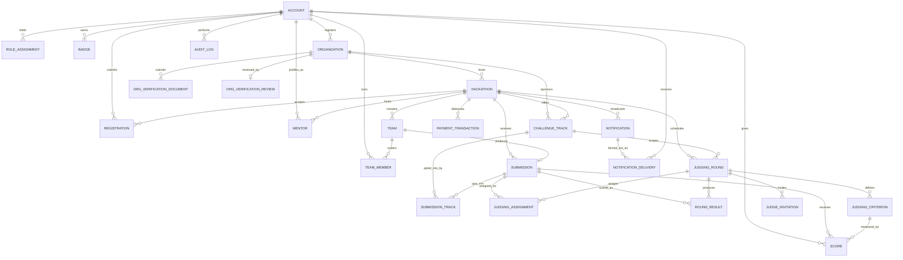

# 05 — Database Design

**Document type:** Database Design Specification
**Audience:** Backend engineers, database administrators, DevOps engineers, technical reviewers
**Status:** Complete — derived from and traceable to the SRS and SDS
**Related documents:** [02 — Software Requirements Specification](02-software-requirements-specification.md) (functional and business-rule source) · [03 — Software Design Specification](03-software-design-specification.md) (module boundaries and multi-tenancy model this schema implements) · [04 — API Specification](04-openapi-specification.yaml) (resource shapes this schema serves) · [08 — Deployment and DevOps](08-deployment-and-devops.md) (backup, RPO/RTO, and migration operations)

---

## 1. Introduction

### 1.1 Purpose

This document specifies the **table-level schema** of the Ethiopia Innovation Hub's primary datastore: engine, column definitions, data types, keys, constraints, and indexes for every persisted entity. Every table exists to satisfy one or more functional requirements or business rules defined in [Document 02](02-software-requirements-specification.md), and every design choice — normalization level, index placement, constraint enforcement — exists to satisfy the module boundaries and multi-tenancy model defined in [Document 03, Sections 3.2–3.3](03-software-design-specification.md#33-multi-tenancy-design). No new product behavior is introduced here; this document is the schema-level realization of decisions already made upstream.

### 1.2 Scope

This document covers the relational schema for PostgreSQL (the system of record per [Document 03, Section 2.2](03-software-design-specification.md#22-level-2--container-diagram)): table definitions grouped by owning Django app, primary and foreign keys, uniqueness and check constraints, indexing strategy, the multi-tenancy scoping columns each table carries, and data-retention/anonymization behavior. It does not cover Redis key design (specified in [Document 03, Section 6.2](03-software-design-specification.md#62-caching-and-queue-design-redis)) or object storage layout (specified in [Document 03, Section 6.3](03-software-design-specification.md#63-object-storage-design-s3-compatible)), though both are referenced where a table stores a pointer into them.

### 1.3 Conventions

| Convention | Rule |
|---|---|
| Primary keys | Every table uses a `UUID` primary key (`uuid_generate_v4()` at insert time), not an auto-incrementing integer, so that IDs are safe to expose in public URLs (FR-DISC-003, FR-SHOWCASE-002) without leaking record counts or ordering. |
| Timestamps | Every table has `created_at` (`TIMESTAMPTZ`, default `now()`); tables that are updated after creation also have `updated_at`, maintained by an ORM-level `save()` hook, not a database trigger, to keep write behavior visible in `models.py` per the layering convention in [Document 03, Section 3.1](03-software-design-specification.md#31-layering-convention). |
| Soft delete | No table is physically deleted from on a user-initiated action. Status/lifecycle columns (`status`, `verification_status`, `eligibility_status`, `withdrawn_at`) represent state transitions; the one exception is the anonymization behavior specified in Section 6 for NFR-COMP-002. |
| Enumerations | Fixed, closed vocabularies (e.g., `location_mode`, `gateway`) are implemented as PostgreSQL `CHECK` constraints against a text column rather than native `ENUM` types, so that adding a new value is a constraint migration, not a type migration — cheaper under the CI/CD pipeline in [Document 03, Section 8.3](03-software-design-specification.md#83-cicd-pipeline-github-actions). |
| Array-shaped fields | Fields that are a bounded list of scalars with no independent lifecycle of their own (`skills`, `technologies`, `tags`, `attachment_urls`) are stored as native PostgreSQL `TEXT[]`, not a join table, since they are never queried by "find all X with skill Y" in the MVP's functional scope — see Section 4.9 if that access pattern is added post-MVP. |
| Money | `amount` is `NUMERIC(12,2)`, never a floating-point type, per standard practice for any column feeding NFR-COMP-001-relevant financial records. |
| Tenant scoping | Every table listed in [Document 03, Section 3.3](03-software-design-specification.md#33-multi-tenancy-design) as tenant-scoped carries an explicit `hackathon_id` and/or `organization_id` foreign key — never an inferred scope via a join — so the `TenantScopedManager` base class described there has a concrete column to require. |

---

## 2. Entity-Relationship Diagram

*Diagram note:* attribute-level detail is intentionally omitted from the ERD and specified per-table in Section 4, to keep the diagram legible; `ROLE_ASSIGNMENT`'s polymorphic `scope_id` (Section 4.1) cannot be drawn as a standard FK and is called out explicitly there.

---

## 4. Table Definitions

Tables are grouped by the Django app that owns them, matching the module-to-requirement mapping in [Document 03, Section 3.2](03-software-design-specification.md#32-module-to-requirement-mapping).

### 4.1 `accounts` app

#### `account`

Implements FR-AUTH-001 through FR-AUTH-005, FR-PROFILE-001 through FR-PROFILE-003.

| Column | Type | Constraints | Notes |
|---|---|---|---|
| `id` | UUID | PK | |
| `email` | CITEXT | `UNIQUE NOT NULL` | Case-insensitive to prevent duplicate accounts differing only by case. |
| `password_hash` | TEXT | `NOT NULL` | Argon2, per NFR-SEC-002. Never populated for OAuth-only accounts (nullable in practice via a separate `has_password` flag rather than allowing `NULL` to mean two different things). |
| `full_name` | TEXT | `NOT NULL` | |
| `bio` | TEXT | | |
| `university` | TEXT | | |
| `date_of_birth` | DATE | | Self-reported (FR-PROFILE-001), same trust level as `university`. Feeds FR-HACK-003's `age_restriction` eligibility check and FR-ANALYTICS-002's age-group breakdown. Range-validated (13-120 years) at the service layer, not by a DB constraint. |
| `country` | CHAR(2) | | ISO 3166-1 alpha-2. Self-reported. Feeds FR-HACK-003's `geographic_restriction` and FR-ANALYTICS-002's country breakdown. |
| `skills` | TEXT[] | | |
| `avatar_url` | TEXT | | Pointer into object storage (Document 03 §6.3). |
| `portfolio_url` | TEXT | | |
| `contact_email` | CITEXT | | Distinct from login `email`; nullable, falls back to `email` if unset. |
| `oauth_provider` | TEXT | `CHECK (oauth_provider IN ('github','google'))` | Nullable. FR-AUTH-005. One linked provider per account row (see accounts/services.py::oauth_login for the documented limitation this implies). |
| `oauth_subject` | TEXT | | External provider's user ID. |
| `verification_status` | TEXT | `CHECK (...) NOT NULL DEFAULT 'unverified'` | `unverified` \| `pending` \| `verified`. Drives FR-AUTH-003. OAuth sign-ups (FR-AUTH-005) start `verified` directly -- the provider already vouched for the email. |
| `email_verified_at` | TIMESTAMPTZ | | |
| `is_platform_admin` | BOOLEAN | `NOT NULL DEFAULT false` | The one global role per [Document 03, Section 4.3](03-software-design-specification.md#43-authorization-model-rbac-tenant-scoped). |
| `token_version` | INTEGER | `NOT NULL DEFAULT 0` | Incremented on password reset, logout-all, or admin suspension (FR-AUTH-004, NFR-SEC-005). Indexed jointly with `id` via the PK for the per-request check described in Document 03 §4.3. |
| `failed_login_count` | SMALLINT | `NOT NULL DEFAULT 0` | Reset on successful login. |
| `lock_until` | TIMESTAMPTZ | | Set per the lockout sequence in Document 03 §4.2. |
| `is_suspended` | BOOLEAN | `NOT NULL DEFAULT false` | FR-ADMIN-001. |
| `last_login_at` | TIMESTAMPTZ | | |
| `deleted_at` | TIMESTAMPTZ | | Set, not row-deleted, on a fulfilled NFR-COMP-002 deletion request; see Section 6. |
| `created_at` / `updated_at` | TIMESTAMPTZ | `NOT NULL` | |

**Indexes:** unique on `email`; unique on (`oauth_provider`, `oauth_subject`) where not null; partial index on `lock_until` where not null (lockout sweep job).

#### `badge`

| Column | Type | Constraints |
|---|---|---|
| `id` | UUID | PK |
| `user_id` | UUID | `NOT NULL, FK → account.id` |
| `type` | TEXT | `CHECK (type IN ('verified_student','hackathon_veteran')) NOT NULL` |
| `awarded_at` | TIMESTAMPTZ | `NOT NULL` |

**Indexes:** (`user_id`).

#### `role_assignment`

Implements the scoped-role model in [Document 03, Section 4.3](03-software-design-specification.md#43-authorization-model-rbac-tenant-scoped): `Organizer`, `Sponsor`, `Judge`, `Mentor`.

| Column | Type | Constraints | Notes |
|---|---|---|---|
| `id` | UUID | PK | |
| `user_id` | UUID | `NOT NULL, FK → account.id` | |
| `role` | TEXT | `CHECK (role IN ('organizer','sponsor','judge','mentor')) NOT NULL` | |
| `scope_type` | TEXT | `CHECK (scope_type IN ('organization','hackathon','track')) NOT NULL` | |
| `scope_id` | UUID | `NOT NULL` | **Polymorphic reference** — not a database-level FK, since it points at `organization.id`, `hackathon.id`, or `challenge_track.id` depending on `scope_type`. Referential integrity for this column is enforced in `services.py`, not the database, and is covered by the 80% business-logic coverage target (NFR-MAINT-001) rather than a `CHECK` constraint, since Postgres cannot express a conditional FK. |
| `created_at` | TIMESTAMPTZ | `NOT NULL` | |

**Indexes:** unique on (`user_id`, `role`, `scope_type`, `scope_id`); (`scope_type`, `scope_id`) for the `HasScopedRole` permission class's reverse lookup ("who holds role X for this resource").

### 4.2 `organizations` app

#### `organization`

Implements FR-ORG-001 through FR-ORG-003.

| Column | Type | Constraints | Notes |
|---|---|---|---|
| `id` | UUID | PK | |
| `name` | TEXT | `NOT NULL` | |
| `type` | TEXT | `CHECK (type IN ('university','company','ngo','government')) NOT NULL` | |
| `contact_email` | CITEXT | `NOT NULL` | |
| `primary_email_domain` | TEXT | | Nullable per FR-ORG-001. |
| `verification_status` | TEXT | `CHECK (...) NOT NULL DEFAULT 'unverified'` | `unverified` \| `pending` \| `verified`. `pending` is entered either via FR-ORG-002's domain-matched fast-track or when documents are submitted for cold FR-ORG-003 review -- in both cases a `Platform Admin` decision is still required to reach `verified`. |
| `domain_fast_tracked` | BOOLEAN | `NOT NULL DEFAULT false` | Set when FR-ORG-002's domain match fired. Informational only -- does **not** grant `verified` status by itself; lets the FR-ORG-003 admin queue surface and prioritize these. |
| `verified_at` | TIMESTAMPTZ | | Set only by a `Platform Admin`'s FR-ORG-003 approval, never by domain match alone. |
| `created_by_user_id` | UUID | `NOT NULL, FK → account.id` | The Organizer of record, per FR-ORG-001's implicit `RoleAssignment`. |
| `created_at` / `updated_at` | TIMESTAMPTZ | `NOT NULL` | |

**Indexes:** (`primary_email_domain`) for the FR-ORG-002 fast-track lookup; (`verification_status`) and (`domain_fast_tracked`) for the FR-ORG-003 admin review queue.

#### `org_verification_document`

| Column | Type | Constraints |
|---|---|---|
| `id` | UUID | PK |
| `organization_id` | UUID | `NOT NULL, FK → organization.id` |
| `file_url` | TEXT | `NOT NULL` |
| `uploaded_by_user_id` | UUID | `NOT NULL, FK → account.id` |
| `uploaded_at` | TIMESTAMPTZ | `NOT NULL` |

**Constraint:** enforced at the service layer, not the database — at most 3 rows per `organization_id` (FR-ORG-003 acceptance criterion).
**Indexes:** (`organization_id`).

#### `org_verification_review`

| Column | Type | Constraints | Notes |
|---|---|---|---|
| `id` | UUID | PK | |
| `organization_id` | UUID | `NOT NULL, FK → organization.id` | |
| `reviewed_by_user_id` | UUID | `NOT NULL, FK → account.id` | Must hold `is_platform_admin`; enforced in `services.py`. |
| `decision` | TEXT | `CHECK (decision IN ('approved','rejected')) NOT NULL` | |
| `rejection_reason` | TEXT | | `NOT NULL` when `decision = 'rejected'`, enforced by a service-layer check rather than a `CHECK` constraint (cross-column conditional constraints are enforced in `services.py` throughout this schema for consistency and testability). |
| `reviewed_at` | TIMESTAMPTZ | `NOT NULL` | Feeds the median-time-to-decision SLA metric (FR-ORG-003). |

**Indexes:** (`organization_id`).

### 4.3 `hackathons` app

#### `hackathon`

Implements FR-HACK-001 through FR-HACK-005, FR-DISC-001 through FR-DISC-003, FR-ELIG-001, FR-ELIG-002, FR-TRACK-001. This is the primary tenant-scope anchor for everything downstream of it.

| Column | Type | Constraints | Notes |
|---|---|---|---|
| `id` | UUID | PK | |
| `host_org_id` | UUID | `NOT NULL, FK → organization.id` | Tenant-scoping column per Document 03 §3.3. |
| `title` | TEXT | `NOT NULL` | |
| `slug` | TEXT | `UNIQUE NOT NULL` | Public URL segment (FR-DISC-003). |
| `description` | TEXT | | |
| `banner_url` | TEXT | | |
| `registration_opens_at` | TIMESTAMPTZ | `NOT NULL` | |
| `registration_closes_at` | TIMESTAMPTZ | `NOT NULL, CHECK (registration_closes_at > registration_opens_at)` | Enforces BR-002 at the schema boundary; the moment-of-close enforcement itself is a service-layer check against `now()`, not a constraint, since it is evaluated per-request rather than per-write. |
| `submission_opens_at` | TIMESTAMPTZ | `NOT NULL` | |
| `submission_closes_at` | TIMESTAMPTZ | `NOT NULL, CHECK (submission_closes_at > submission_opens_at)` | Anchors BR-003's read-only lock. |
| `rules` | TEXT | | |
| `prize_info` | TEXT | | |
| `location_mode` | TEXT | `CHECK (location_mode IN ('online','in_person','hybrid')) NOT NULL` | |
| `eligibility_rules` | JSONB | | Structured per FR-HACK-003; required non-null before publish (BR-004), checked in `services.py`. |
| `tags` | TEXT[] | | |
| `status` | TEXT | `CHECK (status IN ('draft','published','archived')) NOT NULL DEFAULT 'draft'` | |
| `showcase_published_at` | TIMESTAMPTZ | | Null until the Organizer publishes showcase results (FR-SHOWCASE-001); gates BR-007 and BR-008 visibility at the query layer. |
| `created_by_user_id` | UUID | `NOT NULL, FK → account.id` | |
| `created_at` / `updated_at` | TIMESTAMPTZ | `NOT NULL` | |

**Indexes:** unique on `slug`; composite (`status`, `registration_opens_at`) for the FR-DISC-001 published-catalog query; GIN index on `tags` for FR-DISC-002 filtering; GIN trigram index on `title` (via `pg_trgm`) for FR-DISC-002 search, sized against NFR-PERF-002's 5,000-hackathon, sub-1-second target.

#### `challenge_track`

Implements FR-TRACK-001, FR-TRACK-002.

| Column | Type | Constraints |
|---|---|---|
| `id` | UUID | PK |
| `hackathon_id` | UUID | `NOT NULL, FK → hackathon.id` |
| `sponsor_org_id` | UUID | `NOT NULL, FK → organization.id` |
| `name` | TEXT | `NOT NULL` |
| `description` | TEXT | |
| `prize` | TEXT | |
| `rubric_reference` | TEXT | |
| `created_at` | TIMESTAMPTZ | `NOT NULL` |

**Indexes:** (`hackathon_id`); (`sponsor_org_id`) for BR-009's Sponsor-scoped access check.

### 4.4 `registrations` app

#### `registration`

Implements FR-REG-001 through FR-REG-003; enforces BR-002 in combination with `hackathon.registration_closes_at`.

| Column | Type | Constraints | Notes |
|---|---|---|---|
| `id` | UUID | PK | |
| `hackathon_id` | UUID | `NOT NULL, FK → hackathon.id` | |
| `user_id` | UUID | `NOT NULL, FK → account.id` | |
| `eligibility_confirmed` | BOOLEAN | `NOT NULL DEFAULT false` | |
| `custom_answers` | JSONB | | |
| `verification_status` | TEXT | `CHECK (verification_status IN ('unverified','pending','verified')) NOT NULL DEFAULT 'unverified'` | Only meaningful where `hackathon.eligibility_rules` requires institutional verification. |
| `registered_at` | TIMESTAMPTZ | `NOT NULL` | |
| `withdrawn_at` | TIMESTAMPTZ | | FR-REG-002; row is retained, not deleted. |

**Indexes:** unique on (`hackathon_id`, `user_id`) — the schema-level enforcement point for "one registration per user per hackathon"; (`user_id`) for FR-REG-003's "my registrations" query.

### 4.5 `teams` app

#### `team`

Implements FR-TEAM-001, FR-TEAM-005.

| Column | Type | Constraints |
|---|---|---|
| `id` | UUID | PK |
| `hackathon_id` | UUID | `NOT NULL, FK → hackathon.id` |
| `team_name` | TEXT | `NOT NULL` |
| `leader_user_id` | UUID | `NOT NULL, FK → account.id` |
| `open_to_members` | BOOLEAN | `NOT NULL DEFAULT true` |
| `max_size` | SMALLINT | `NOT NULL, CHECK (max_size > 0)` |
| `created_at` | TIMESTAMPTZ | `NOT NULL` |

**Indexes:** (`hackathon_id`); unique on (`hackathon_id`, `team_name`) to keep team names disambiguating within a single event.

#### `team_member`

Implements FR-TEAM-002 through FR-TEAM-004; the same row models both a pending invitation and an accepted membership, matching the sequence design in [Document 03, Section 5.1](03-software-design-specification.md#51-team-invitation-and-acceptance-fr-team-002-fr-team-003).

| Column | Type | Constraints | Notes |
|---|---|---|---|
| `id` | UUID | PK | |
| `team_id` | UUID | `NOT NULL, FK → team.id` | |
| `user_id` | UUID | `FK → account.id` | Nullable: an invitation sent to an email not yet matched to an accepting session is still resolved to a `user_id` at invite time per FR-TEAM-002's precondition that the invitee is already registered, so in practice this is populated at creation; retained as nullable only to tolerate a future direct-email invite path without a migration. |
| `invitee_email` | CITEXT | | Denormalized copy of the invited account's email, retained for notification resend even if the account is later modified. |
| `join_status` | TEXT | `CHECK (join_status IN ('pending','accepted','declined')) NOT NULL DEFAULT 'pending'` | |
| `invited_at` | TIMESTAMPTZ | `NOT NULL` | |
| `expires_at` | TIMESTAMPTZ | `NOT NULL` | `invited_at + 7 days`, per FR-TEAM-002. |
| `responded_at` | TIMESTAMPTZ | | |

**Constraints (service-layer, not database):** a team's count of `join_status = 'accepted'` rows must not exceed `team.max_size`; a user may hold an `accepted` `team_member` row for at most one team per `hackathon_id` (BR-001) — enforced via a partial unique index described below plus a service-layer pre-check, since the hackathon scope is one join away from this table.
**Indexes:** (`team_id`); partial unique index on (`user_id`) where `join_status = 'accepted'` **scoped per hackathon** is implemented as a unique index on (`hackathon_id`, `user_id`) against a materialized `hackathon_id` column denormalized onto `team_member` from `team` at write time — the deliberate trade-off is a small denormalized column in exchange for BR-001 being a database-level guarantee rather than a service-layer-only one, consistent with the "structural enforcement over convention" precedent set by `TenantScopedManager` in Document 03 §3.3.

### 4.6 `submissions` app

#### `submission`

Implements FR-SUB-001 through FR-SUB-004; enforces BR-003 and BR-006 in combination with `hackathon.submission_closes_at`.

| Column | Type | Constraints | Notes |
|---|---|---|---|
| `id` | UUID | PK | |
| `hackathon_id` | UUID | `NOT NULL, FK → hackathon.id` | |
| `team_id` | UUID | `NOT NULL, UNIQUE, FK → team.id` | One submission per team — the `UNIQUE` constraint is the schema-level expression of that rule. |
| `title` | TEXT | `NOT NULL` | |
| `tagline` | TEXT | | |
| `description` | TEXT | | |
| `technologies` | TEXT[] | | |
| `repo_link` | TEXT | `NOT NULL` | |
| `demo_video_url` | TEXT | | |
| `attachment_urls` | TEXT[] | | Pointers into object storage per direct-upload design (ADR-005). |
| `eligibility_status` | TEXT | `CHECK (eligibility_status IN ('pending','eligible','disqualified')) NOT NULL DEFAULT 'eligible'` | Defaults to `eligible` per BR-006, not `pending`. |
| `eligibility_reason` | TEXT | | Required when `eligibility_status = 'disqualified'`; service-layer check. Written to `audit_log` per Document 03 §6.6. |
| `eligibility_reviewed_by_user_id` | UUID | `FK → account.id` | |
| `eligibility_reviewed_at` | TIMESTAMPTZ | | |
| `is_finalized` | BOOLEAN | `NOT NULL DEFAULT false` | FR-SUB-003. |
| `submitted_at` | TIMESTAMPTZ | | First-save timestamp; distinct from finalization. |
| `locked_at` | TIMESTAMPTZ | | Set by the deadline-enforcement job in [Document 03, Section 5.2](03-software-design-specification.md#52-deadline-enforcement--submission-lock-br-003-fr-sub-003); once set, `services.py` rejects further writes regardless of `is_finalized`. |
| `created_at` / `updated_at` | TIMESTAMPTZ | `NOT NULL` | |

**Indexes:** unique on `team_id`; (`hackathon_id`, `eligibility_status`) for the FR-ELIG-002 bulk screening view.

#### `submission_track`

Implements the track opt-in referenced in FR-JUDGE-004 and FR-TRACK-002.

| Column | Type | Constraints |
|---|---|---|
| `submission_id` | UUID | `NOT NULL, FK → submission.id` |
| `track_id` | UUID | `NOT NULL, FK → challenge_track.id` |

**Primary key:** composite (`submission_id`, `track_id`).
**Indexes:** (`track_id`) for BR-009's Sponsor-scoped submission listing.

### 4.7 `judging` app

#### `judging_round`

Implements FR-JUDGE-004. A round with `track_id IS NULL` is the implicit Overall round.

| Column | Type | Constraints | Notes |
|---|---|---|---|
| `id` | UUID | PK | |
| `hackathon_id` | UUID | `NOT NULL, FK → hackathon.id` | |
| `track_id` | UUID | `FK → challenge_track.id` | Nullable = Overall round. |
| `status` | TEXT | `CHECK (status IN ('not_started','open','closed')) NOT NULL DEFAULT 'not_started'` | Transition to `open` is the trigger for BR-005's rubric lock. |
| `opened_at` | TIMESTAMPTZ | | |
| `closed_at` | TIMESTAMPTZ | | |

**Indexes:** unique on (`hackathon_id`, `track_id`) — including the `track_id IS NULL` case via a Postgres partial unique index, so a hackathon has at most one Overall round and at most one round per track; (`hackathon_id`).

#### `judging_criterion`

Implements FR-HACK-004; enforces BR-005 (immutability once the owning round is `open`) at the service layer.

| Column | Type | Constraints | Notes |
|---|---|---|---|
| `id` | UUID | PK | |
| `round_id` | UUID | `NOT NULL, FK → judging_round.id` | |
| `name` | TEXT | `NOT NULL, CHECK (char_length(name) <= 100)` | |
| `min_score` | INTEGER | `NOT NULL` | |
| `max_score` | INTEGER | `NOT NULL, CHECK (max_score > min_score)` | |
| `weight` | NUMERIC(5,2) | `NOT NULL, CHECK (weight >= 0 AND weight <= 100)` | Sum of a round's criteria weights must equal 100; enforced in `services.py` on save, since a cross-row `SUM() = 100` constraint is not expressible as a single-row `CHECK`. |

**Indexes:** (`round_id`).

#### `judging_assignment`

Implements FR-JUDGE-001.

| Column | Type | Constraints |
|---|---|---|
| `id` | UUID | PK |
| `round_id` | UUID | `NOT NULL, FK → judging_round.id` |
| `submission_id` | UUID | `NOT NULL, FK → submission.id` |
| `judge_user_id` | UUID | `NOT NULL, FK → account.id` |
| `assigned_at` | TIMESTAMPTZ | `NOT NULL` |
| `reassigned_from_user_id` | UUID | `FK → account.id` |

**Indexes:** unique on (`round_id`, `submission_id`, `judge_user_id`); (`judge_user_id`) for a judge's personal queue.

#### `judge_invitation`

Implements the judge-onboarding path underlying FR-JUDGE-001.

| Column | Type | Constraints |
|---|---|---|
| `id` | UUID | PK |
| `email` | CITEXT | `NOT NULL` |
| `round_id` | UUID | `NOT NULL, FK → judging_round.id` |
| `status` | TEXT | `CHECK (status IN ('sent','accepted','expired')) NOT NULL DEFAULT 'sent'` |
| `invited_at` | TIMESTAMPTZ | `NOT NULL` |
| `responded_at` | TIMESTAMPTZ | |

**Indexes:** (`round_id`); (`email`).

#### `score`

Implements FR-JUDGE-002; enforces BR-008 (never exposed outside the Organizer dashboard) at the query/serializer layer, not the schema.

| Column | Type | Constraints | Notes |
|---|---|---|---|
| `id` | UUID | PK | |
| `submission_id` | UUID | `NOT NULL, FK → submission.id` | |
| `judge_user_id` | UUID | `NOT NULL, FK → account.id` | |
| `criterion_id` | UUID | `NOT NULL, FK → judging_criterion.id` | |
| `score_value` | INTEGER | `NOT NULL` | Range-checked against the parent criterion's `min_score`/`max_score` in `services.py` (a cross-table `CHECK` is not expressible natively). |
| `comment` | TEXT | | |
| `created_at` / `updated_at` | TIMESTAMPTZ | `NOT NULL` | A judge revising a score before round close is an `UPDATE`, not a new row. |

**Indexes:** unique on (`submission_id`, `judge_user_id`, `criterion_id`) — one score per judge per criterion per submission.

#### `round_result`

Materializes FR-JUDGE-003's calculated results, so results are computed once (by the async job described in [Document 03, Section 5.3](03-software-design-specification.md#53-judging-and-result-calculation-fr-judge-002-fr-judge-003)) and read many times from the showcase and organizer dashboard, rather than aggregated from `score` on every read.

| Column | Type | Constraints | Notes |
|---|---|---|---|
| `id` | UUID | PK | |
| `round_id` | UUID | `NOT NULL, FK → judging_round.id` | |
| `submission_id` | UUID | `NOT NULL, FK → submission.id` | |
| `aggregate_score` | NUMERIC(6,2) | `NOT NULL` | Weighted sum across the round's criteria. |
| `rank` | SMALLINT | | Within the round. |
| `calculated_at` | TIMESTAMPTZ | `NOT NULL` | Recomputed (row replaced, not appended) whenever a constituent score changes before round close. |

**Indexes:** unique on (`round_id`, `submission_id`); (`round_id`, `rank`) for ordered result retrieval.

### 4.8 `notifications` app

#### `notification`

Implements FR-NOTIFY-001, FR-NOTIFY-002 — the logical message.

| Column | Type | Constraints |
|---|---|---|
| `id` | UUID | PK |
| `hackathon_id` | UUID | `FK → hackathon.id` |
| `message` | TEXT | `NOT NULL` |
| `channel` | TEXT | `CHECK (channel IN ('email','in_portal','sms')) NOT NULL` |
| `created_at` | TIMESTAMPTZ | `NOT NULL` |

**Indexes:** (`hackathon_id`).

#### `notification_delivery`

Per-recipient fan-out and delivery status, separated from `notification` so that a single broadcast (e.g., a deadline reminder to every registrant) does not require one `notification` row per recipient, and so NFR-PERF-003's 60-second delivery SLA and NFR-AVAIL-003's SMS-isolation requirement are each independently measurable per delivery.

| Column | Type | Constraints |
|---|---|---|
| `id` | UUID | PK |
| `notification_id` | UUID | `NOT NULL, FK → notification.id` |
| `user_id` | UUID | `NOT NULL, FK → account.id` |
| `channel` | TEXT | `CHECK (channel IN ('email','in_portal','sms')) NOT NULL` |
| `status` | TEXT | `CHECK (status IN ('pending','sent','failed')) NOT NULL DEFAULT 'pending'` |
| `sent_at` | TIMESTAMPTZ | |
| `failure_reason` | TEXT | |

**Indexes:** (`notification_id`); (`user_id`, `status`) for a user's in-portal notification feed.

### 4.9 `mentors` app

#### `mentor`

Supports the Mentor role surfaced in [Document 04](04-openapi-specification.yaml)'s `Mentor` schema; scoped per hackathon since mentor availability is offered per event.

| Column | Type | Constraints |
|---|---|---|
| `id` | UUID | PK |
| `user_id` | UUID | `NOT NULL, FK → account.id` |
| `hackathon_id` | UUID | `NOT NULL, FK → hackathon.id` |
| `skills` | TEXT[] | |
| `availability` | TEXT | |
| `created_at` | TIMESTAMPTZ | `NOT NULL` |

**Indexes:** unique on (`user_id`, `hackathon_id`); (`hackathon_id`).

### 4.10 Payments

Payments are modeled as a `core`-adjacent concern rather than owned by any single lifecycle app, since a `PaymentTransaction` can be tied to prize disbursement (`judging`) or sponsor billing, both of which are hackathon-scoped.

#### `payment_transaction`

| Column | Type | Constraints | Notes |
|---|---|---|---|
| `id` | UUID | PK | |
| `hackathon_id` | UUID | `NOT NULL, FK → hackathon.id` | |
| `recipient_user_id` | UUID | `NOT NULL, FK → account.id` | |
| `amount` | NUMERIC(12,2) | `NOT NULL, CHECK (amount > 0)` | |
| `currency` | TEXT | `NOT NULL DEFAULT 'ETB'` | |
| `gateway` | TEXT | `CHECK (gateway IN ('telebirr','cbe_birr','chapa')) NOT NULL` | |
| `gateway_reference` | TEXT | | External transaction ID, once returned by the gateway. |
| `status` | TEXT | `CHECK (status IN ('pending','completed','failed')) NOT NULL DEFAULT 'pending'` | |
| `created_at` / `updated_at` | TIMESTAMPTZ | `NOT NULL` | |

**Indexes:** (`hackathon_id`); (`recipient_user_id`); unique on `gateway_reference` where not null.

### 4.11 `core` app

#### `audit_log`

Implements the append-only audit trail described in [Document 03, Section 6.6](03-software-design-specification.md#66-observability), backing FR-ELIG-001, FR-ADMIN-001, FR-ADMIN-002, and FR-JUDGE-001's reassignment record. This table has no `updated_at` and no service-layer update path — rows are inserted only.

| Column | Type | Constraints | Notes |
|---|---|---|---|
| `id` | UUID | PK | |
| `actor_user_id` | UUID | `FK → account.id` | Nullable for system-initiated actions (e.g., the automated deadline lock in Document 03 §5.2). |
| `action` | TEXT | `NOT NULL` | e.g. `submission.disqualified`, `organization.verification_reviewed`, `judging_assignment.reassigned`. |
| `entity_type` | TEXT | `NOT NULL` | The table name the action concerns. |
| `entity_id` | UUID | `NOT NULL` | |
| `metadata` | JSONB | | Free-form context (e.g., a disqualification reason, an admin search query). |
| `created_at` | TIMESTAMPTZ | `NOT NULL` | |

**Indexes:** (`entity_type`, `entity_id`) for "show me the history of this record"; (`actor_user_id`, `created_at`) for "show me what this admin did"; (`created_at`) for retention-window queries. No index is dropped or record purged on a retention schedule — FR-ADMIN-001 specifies indefinite retention for audit purposes, which NFR-COMP-001's data-protection alignment treats as a distinct lawful-basis category from ordinary user content (documented in Document 08's data-handling runbook).

---

## 5. Indexing Strategy Summary

Beyond the per-table indexes in Section 4, the following cross-cutting choices exist specifically to satisfy Section 5 of the SRS:

| Requirement | Schema response |
|---|---|
| NFR-PERF-001 (95th-percentile request latency) | Every foreign key used in a `TenantScopedManager` filter (Document 03 §3.3) is indexed, since every authenticated request's first query is a tenant-scoped filter. |
| NFR-PERF-002 (sub-1-second discovery search at 5,000 hackathons) | `pg_trgm` GIN index on `hackathon.title`; GIN index on `hackathon.tags`; composite (`status`, `registration_opens_at`) index for the default published-and-open filter. |
| NFR-SCALE-002 (50,000 users, 500 concurrent hackathons without redesign) | UUID primary keys avoid sequence contention under concurrent write bursts (e.g., a national hackathon's registration opening, per NFR-SCALE-001); all high-write tables (`registration`, `team_member`, `score`) have narrow row widths and no unindexed foreign key. |
| BR-001 (one team per participant per hackathon) | Denormalized `hackathon_id` on `team_member` plus a unique partial index (Section 4.5), making this a database-enforced invariant rather than a service-layer-only one. |
| BR-009 (Sponsor scoped to assigned tracks) | `submission_track.track_id` and `challenge_track.sponsor_org_id` are both indexed, since every Sponsor-facing query joins through both in a single request. |

---

## 6. Data Retention and Anonymization (NFR-COMP-002)

A fulfilled deletion request does not `DELETE` a user's `submission` or `team_member` rows where doing so would remove a teammate's attribution from a published showcase result (FR-SHOWCASE-001). Instead:

- `account.deleted_at` is set, `email` is rewritten to a non-reversible placeholder, and `password_hash`, `oauth_subject`, `bio`, `avatar_url`, `portfolio_url`, and `skills` are cleared.
- Rows in `submission`, `team_member`, `score`, and `round_result` that reference the deleted account are **not** deleted; the account-level anonymization above means they no longer resolve to identifying information when joined back to `account`, which is the mechanism by which "author unlinked" (NFR-COMP-002's own phrase) is achieved without breaking other team members' published results.
- `audit_log` rows referencing the account as `actor_user_id` are retained un-anonymized, since audit retention is a distinct lawful basis from the deleted account's own profile data (Section 4.11).
- The 30-day fulfillment window is enforced operationally (a queued job, tracked outside this schema), not by a database constraint.

---

## 7. Migration Strategy

Schema changes are applied as Django migrations, one migration file per app per change, run in the CI/CD pipeline's staging-promotion step described in [Document 03, Section 8.3](03-software-design-specification.md#83-cicd-pipeline-github-actions) before any production deploy — consistent with ADR-004's premise that row-level (not schema-per-tenant) multi-tenancy keeps migrations single-pass. Additive, backward-compatible migrations (new nullable column, new table, new index) may ship in the same release as the API version that uses them; any migration that removes or narrows a column follows the two-step expand/contract pattern (deploy code that stops reading the column, then a later migration that drops it) so that NFR-MAINT-003's API-versioning guarantee is never broken by a schema change alone.

---

## 8. Requirement Traceability

| Requirement/Rule | Table(s) |
|---|---|
| FR-AUTH-001 – FR-AUTH-004 | `account` |
| FR-PROFILE-001 – FR-PROFILE-003 | `account` |
| FR-ORG-001 – FR-ORG-003 | `organization`, `org_verification_document`, `org_verification_review` |
| FR-HACK-001 – FR-HACK-005 | `hackathon` |
| FR-DISC-001 – FR-DISC-003 | `hackathon` |
| FR-REG-001 – FR-REG-003 | `registration` |
| FR-TEAM-001 – FR-TEAM-005 | `team`, `team_member` |
| FR-SUB-001 – FR-SUB-004 | `submission`, `submission_track` |
| FR-ELIG-001 – FR-ELIG-002 | `submission` |
| FR-JUDGE-001 – FR-JUDGE-004 | `judging_round`, `judging_criterion`, `judging_assignment`, `judge_invitation`, `score`, `round_result` |
| FR-TRACK-001 – FR-TRACK-002 | `challenge_track` |
| FR-SHOWCASE-001 – FR-SHOWCASE-002 | `hackathon.showcase_published_at`, `round_result` |
| FR-NOTIFY-001 – FR-NOTIFY-002 | `notification`, `notification_delivery` |
| FR-ANALYTICS-001 – FR-ANALYTICS-002 | Derived from `registration`, `team`, `submission` (no dedicated table; see Document 03 §6 for the query/caching approach) |
| FR-ADMIN-001 – FR-ADMIN-002 | `audit_log`, plus platform-wide reads across all tables |
| BR-001 | `team_member` (denormalized `hackathon_id` + partial unique index) |
| BR-002 | `hackathon.registration_closes_at` |
| BR-003 | `submission.locked_at`, `team_member.expires_at` |
| BR-004 | `hackathon.eligibility_rules`, `judging_criterion` |
| BR-005 | `judging_round.status`, `judging_criterion` (immutability enforced in `services.py`) |
| BR-006 | `submission.eligibility_status` default |
| BR-007, BR-008 | `hackathon.showcase_published_at`, `score` (query-layer restriction) |
| BR-009 | `submission_track`, `challenge_track.sponsor_org_id` |
| BR-010 | `organization.verification_status`, checked in `services.py` at FR-HACK-005 publish time |
| BR-011 | Enforced at the analytics query layer, not the schema (no table stores sub-cohort demographic breakdowns below the size-10 threshold) |
| BR-012 | `account` (no schema change; enumeration prevention is a response-shape behavior) |
| NFR-SCALE-002 | Section 5 (indexing strategy) |
| NFR-COMP-002 | Section 6 (retention and anonymization) |

---

*End of Document 05.*
