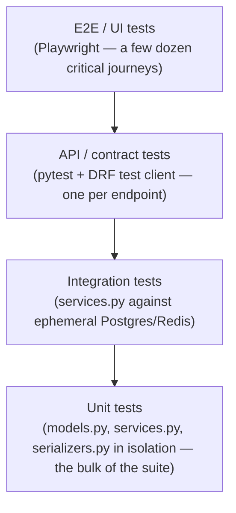
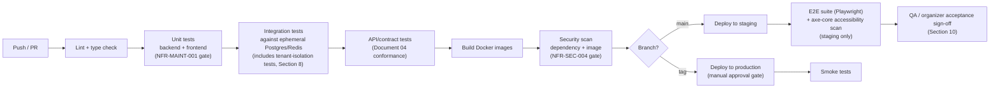

# 07 — Testing and Quality Assurance

**Document type:** Testing and Quality Assurance Plan
**Audience:** QA engineers, backend engineers, frontend engineers, DevOps engineers, technical reviewers
**Status:** Complete — derived from and traceable to the SRS, SDS, and UI/UX Specification
**Related documents:** [02 — Software Requirements Specification](02-software-requirements-specification.md) (source of every `FR-*`/`BR-*`/`NFR-*` this document verifies) · [03 — Software Design Specification](03-software-design-specification.md), [Section 3.1](03-software-design-specification.md#31-layering-convention) (the layering this document's unit/integration split is built on) and [Section 8.3](03-software-design-specification.md#83-cicd-pipeline-github-actions) (the pipeline this document's gates extend) · [06 — UI/UX Specification](06-ui-ux-specification.md) (the screens and flows this document's usability/accessibility/e2e tests exercise) · [08 — Deployment and DevOps](08-deployment-and-devops.md) (staging/production promotion this document's exit criteria gate)

---

## 1. Introduction

### 1.1 Purpose

This document specifies **how the Ethiopia Innovation Hub is verified**: the testing levels applied to each architectural layer, the tooling and environments used, the coverage and exit-criteria thresholds already fixed as non-functional requirements, and — per [Document 02, Section 6](02-software-requirements-specification.md#6-requirement-traceability) — the full requirement-to-test traceability matrix mapping every `FR-*` and `NFR-*` ID to at least one test case, satisfying NFR-MAINT-002.

### 1.2 Scope

This document covers test strategy and methodology (Section 2), environments and tooling (Section 3), coverage and exit criteria (Section 4), the CI/CD test gate pipeline (Section 5), functional test design per module (Section 6), non-functional test methodology (Section 7), multi-tenancy and authorization test strategy (Section 8), defect management (Section 9), pilot/UAT acceptance testing (Section 10), and the full traceability matrix (Section 11). It does not cover deployment mechanics themselves (promotion, rollback, monitoring configuration) — those are specified in [Document 08](08-deployment-and-devops.md); this document specifies only the tests that gate that promotion.

### 1.3 Test identification format

Every test case referenced in this document has an ID of the form `TC-<MODULE>-<NNN><suffix>`, where `<MODULE>` matches the SRS module code (Document 02, Section 1.3) and `<NNN>` matches the `FR-*` number it verifies, so a test ID is traceable to its requirement on sight (e.g., `TC-TEAM-002a` verifies the first acceptance criterion of FR-TEAM-002). Non-functional test cases use `TC-NFR-<CATEGORY>-<NNN>`, matching the corresponding `NFR-*` ID directly.

---

## 2. Testing Strategy and Levels

The test pyramid mirrors the four-layer backend convention fixed in [Document 03, Section 3.1](03-software-design-specification.md#31-layering-convention) and the SSR/CSR split fixed in [Document 03, Section 7.1](03-software-design-specification.md#71-structure):

| Level | What it exercises | Why here |
|---|---|---|
| **Unit** | `services.py` business logic in isolation (mocked DB/queue where practical), `serializers.py` field validation, `models.py` constraints | Because business rules live in `services.py` by design (Document 03 §3.1), this is where acceptance criteria expressed as business behavior — e.g., FR-TEAM-002's 7-day expiry — are tested directly, without HTTP overhead, which is what makes the NFR-MAINT-001 80% coverage target achievable and fast enough to run on every push. |
| **Integration** | `services.py` and `models.py` together against a real ephemeral Postgres/Redis, including `TenantScopedManager` behavior (Document 03 §3.3) | Business logic that spans multiple models (e.g., "invite a team member" writing a row and enqueuing a notification job) needs a real transaction boundary to verify correctly. |
| **API / contract** | `views.py` and `serializers.py` via the DRF test client against [Document 04](04-openapi-specification.yaml)'s contract | Verifies HTTP status codes, the shared error envelope (Document 03 §6.5), and authorization behavior (Section 8) at the boundary a real client hits. |
| **E2E / UI** | Full user journeys through the rendered frontend (Playwright, headless Chromium) against a staging-equivalent stack | Reserved for the critical paths in [Document 06, Section 6](06-ui-ux-specification.md#6-key-user-flows) — registration→team→submission, organizer create→publish→judge→showcase — since full-stack E2E tests are the most expensive to write and maintain and are not a substitute for the lower levels. |

Frontend component logic (`components/ui`, `features/*` per Document 06 §7) is unit-tested with a component-testing tool (e.g., Testing Library) at the same pyramid position as backend unit tests, independent of the E2E layer above.

---

## 3. Test Environments and Tooling

| Environment | Purpose | Data |
|---|---|---|
| `development` (local) | Developer-run unit/integration tests on every save | Seeded fixture data, per [Document 03, Section 8.2](03-software-design-specification.md#82-environments) |
| CI (ephemeral, per-PR) | Automated unit, integration, API, and security-scan gates (Section 5) | Fresh ephemeral Postgres/Redis containers per run, no persisted state between runs |
| `staging` | E2E suite, manual QA/organizer acceptance testing, performance and accessibility audits, before a pilot hackathon | Mirrors production topology at reduced scale (Document 03 §8.2); realistic but synthetic multi-tenant data, including multiple organizations and hackathons, specifically to exercise tenant-isolation tests (Section 8) |
| `production` | Smoke tests only, post-deploy (Document 03 §8.3) | Real data; no destructive or load testing is ever run here |

| Concern | Tooling |
|---|---|
| Backend unit/integration/API tests | `pytest` + `pytest-django`, DRF `APIClient` |
| Frontend unit/component tests | Testing Library (component tests co-located with `features/*` per Document 06 §7) |
| E2E tests | Playwright, run against `staging` |
| Performance/load tests | k6, run against `staging` only |
| Accessibility audits | Automated: `axe-core` integrated into the E2E suite for every public screen (Document 06 §5.1–5.7 public rows); manual: a screen-reader and keyboard-only pass before each production release touching a public screen |
| Security scanning | Dependency and container image scanning in CI (Document 03 §8.3, gate F); a manual OWASP Top 10-aligned review before first production pilot (NFR-SEC-004) |
| Coverage measurement | `coverage.py` (backend), integrated into the CI unit-test stage |

---

## 4. Coverage and Exit Criteria

| Gate | Threshold | Enforced by |
|---|---|---|
| Backend business-logic coverage | ≥ 80% (NFR-MAINT-001) | CI unit-test stage; a PR that drops coverage below threshold fails the build (Document 03 §8.3, gate C) |
| Requirement traceability | Every `FR-*` in Document 02, Section 3 has ≥ 1 automated test (NFR-MAINT-002) | Section 11 of this document, reviewed at each Document 02 revision |
| Authorization coverage | Every `FR-*` with an access-control acceptance criterion has a dedicated authorization test (NFR-SEC-003) | Section 8 of this document |
| Security | Zero unremediated Critical/High findings before first production pilot (NFR-SEC-004) | Manual security review sign-off, staging exit gate |
| Accessibility | Zero Critical/Serious `axe-core` violations on public screens (NFR-ACC-001) before a release touching those screens ships | Staging exit gate |
| Usability | FR-HACK-001–005 completed in under 20 minutes by ≥ 5 untrained representative Organizers (NFR-USE-001) | One-time (and post-major-change) moderated usability study, tracked outside the automated suite |

A release is blocked from production promotion if any threshold above is not met; there is no override path short of a documented, time-boxed exception approved by the same reviewers who own [Document 08](08-deployment-and-devops.md)'s deployment gate.

---

## 5. CI/CD Test Gate Pipeline

This extends the pipeline already fixed in [Document 03, Section 8.3](03-software-design-specification.md#83-cicd-pipeline-github-actions) with the specific test responsibilities at each stage:

A failing stage blocks progression, consistent with Document 03 §8.3. The E2E and accessibility stages run only against `staging`, never in the per-PR ephemeral CI environment, since they require a full running stack rather than isolated test containers.

---

## 6. Functional Test Strategy by Module

Each module's test design follows the pyramid in Section 2: unit tests cover every acceptance criterion expressible without cross-service orchestration; integration and API tests cover the rest; E2E tests cover only the journeys in [Document 06, Section 6](06-ui-ux-specification.md#6-key-user-flows). Representative (not exhaustive) test cases per module:

| Module | Representative test cases | Level |
|---|---|---|
| AUTH | `TC-AUTH-001a` reject signup below password complexity rule · `TC-AUTH-002a` lock account after 5 failed logins within 15 min (Document 03 §4.2 sequence) · `TC-AUTH-003a` verification link expires at 24h · `TC-AUTH-004a` password reset invalidates all sessions | Unit + Integration |
| PROFILE | `TC-PROFILE-001a` reject bio > 500 chars · `TC-PROFILE-002a` private profile returns 404 not 403 (BR-012 enumeration prevention) · `TC-PROFILE-003a` reject non-JPEG/PNG/WebP avatar | Unit + API |
| ORG | `TC-ORG-002a` domain match auto-verifies within request cycle · `TC-ORG-003a` reject rejection review with no reason | Integration |
| HACK | `TC-HACK-004a` reject rubric where criteria weights don't sum to 100 (BR-004) · `TC-HACK-005a` publish rejected with specific missing-field list · `TC-HACK-005b` unpublish blocked once registrations exist | Unit + API |
| DISC | `TC-DISC-001a` closed-registration hackathon remains listed until end date · `TC-DISC-002a` combined filters use AND logic · `TC-DISC-002b` empty-result search shows empty state not error | API + E2E |
| REG | `TC-REG-001a` duplicate registration returns 409 · `TC-REG-001b` registration after deadline rejected regardless of client clock (BR-002) · `TC-REG-002a` withdrawal after submission deadline rejected | Unit + Integration |
| TEAM | `TC-TEAM-001a` second team creation in same hackathon rejected (BR-001) · `TC-TEAM-002a` invitation auto-expires at 7 days · `TC-TEAM-003a` concurrent-acceptance race reverts second acceptance to pending · `TC-TEAM-004a` ownership transfers to longest-tenured member on owner departure | Unit + Integration + E2E |
| SUB | `TC-SUB-001a` second creation attempt updates existing draft, not duplicate · `TC-SUB-002a` reject 6th media attachment · `TC-SUB-003a` all submissions lock at deadline regardless of draft/final state (BR-003) | Unit + Integration + E2E |
| ELIG | `TC-ELIG-001a` disqualification requires reason ≥ 10 chars · `TC-ELIG-001b` unscreened submission defaults eligible at judging-open (BR-006) | Unit + API |
| JUDGE | `TC-JUDGE-001a` automatic distribution keeps assignment-count spread ≤ 1 · `TC-JUDGE-002a` reject out-of-range criterion score · `TC-JUDGE-002b` rubric immutable once round is open (BR-005) · `TC-JUDGE-003a` weighted-mean calculation correctness · `TC-JUDGE-003b` zero-judge submission excluded and flagged, not scored zero · `TC-JUDGE-004a` track result never affects Overall result | Unit + Integration |
| TRACK | `TC-TRACK-002a` Sponsor sees only submissions opted into their assigned track (BR-009) | Integration + API |
| SHOWCASE | `TC-SHOWCASE-001a` results not auto-published on judging close · `TC-SHOWCASE-001b` disqualified submissions excluded by default · `TC-SHOWCASE-001c` judge identities/scores never present in showcase payload (BR-008) | API |
| NOTIFY | `TC-NOTIFY-001a` email sent within 60s for ≥ 99% of a simulated event batch · `TC-NOTIFY-002a` SMS failure does not delay email | Integration + Performance |
| ANALYTICS | `TC-ANALYTICS-002a` cohort below 10 shows placeholder, not partial data (BR-011) | Unit + API |
| ADMIN | `TC-ADMIN-001a` non-admin receives 403 on every admin endpoint · `TC-ADMIN-001b` suspension removes hackathon from discovery while preserving data | API + Integration |
| I18N | `TC-I18N-001a` form input retained across language switch · `TC-I18N-002a` notifications sent in recipient's stored language preference | E2E + Integration |

---

## 7. Non-Functional Test Methodology

### 7.1 Performance (NFR-PERF-001 – 004)

k6 load scripts run against `staging` only, modeling the specific load profiles named in Document 02, Section 5.1:

| Test | Method |
|---|---|
| `TC-NFR-PERF-001` | Sustained 500 concurrent authenticated users; assert p95 < 500ms, p99 < 1,500ms across the endpoint mix. |
| `TC-NFR-PERF-002` | Discovery search/filter at a seeded 5,000-hackathon catalog; assert response < 1s. |
| `TC-NFR-PERF-003` | Trigger a batch of FR-NOTIFY-001 events; assert ≥ 99% emailed within 60s. |
| `TC-NFR-PERF-004` | Lighthouse/WebPageTest run against the hackathon detail page under a throttled 400 Kbps / 400 ms RTT profile; assert LCP < 2.5s. |

### 7.2 Security (NFR-SEC-001 – 005)

| Test | Method |
|---|---|
| `TC-NFR-SEC-001` | Assert plaintext HTTP redirects to HTTPS on every route; TLS version check. |
| `TC-NFR-SEC-002` | Static/manual review confirming no plaintext or reversible password storage path exists; Argon2 parameters reviewed. |
| `TC-NFR-SEC-003` | See Section 8 — one authorization test per access-control acceptance criterion. |
| `TC-NFR-SEC-004` | Dependency and image scan in CI (automated, every build); manual OWASP Top 10-aligned penetration review before first pilot, with Critical/High findings remediated and re-verified before the staging exit gate is signed off. |
| `TC-NFR-SEC-005` | Assert refresh tokens invalidated on password reset; assert an individually revoked session (via `token_version` bump, Document 03 §4.3) is rejected on its next request even with an unexpired access token. |

### 7.3 Availability and reliability (NFR-AVAIL-001 – 003)

| Test | Method |
|---|---|
| `TC-NFR-AVAIL-002` | Restore drill against a backup snapshot in `staging`; assert data loss ≤ RPO (24h) and restore completes within RTO (4h). |
| `TC-NFR-AVAIL-003` | Dependency-isolation test: simulate SMS gateway failure/timeout and assert no other platform function (including FR-NOTIFY-001 email delivery) degrades. |

Uptime (NFR-AVAIL-001) is a production monitoring metric, not a pre-release test; it is tracked per [Document 08](08-deployment-and-devops.md).

### 7.4 Accessibility (NFR-ACC-001 – 003)

Automated `axe-core` scans run as part of the E2E suite against every public screen in [Document 06, Sections 5.1–5.7](06-ui-ux-specification.md#5-screen-inventory) (public rows only, per NFR-ACC-001's scope), gating zero Critical/Serious violations. A manual pass supplements automation for what it cannot verify: full keyboard-only traversal of each public screen (NFR-ACC-002) and a screen-reader spot check confirming alt text renders in the active interface language (NFR-ACC-003).

### 7.5 Usability (NFR-USE-001 – 003)

- `TC-NFR-USE-001`: moderated usability study, ≥ 5 representative untrained Organizers, task = complete the Hackathon Wizard from creation through publish (Document 06 §6.2); pass criterion is a median completion time under 20 minutes with no facilitator intervention required to complete the task.
- `TC-NFR-USE-002`: E2E suite runs the registration→team→submission journey (Document 06 §6.1) under a throttled 3G network profile; assert the flow completes and total page weight stays under 2 MB.
- `TC-NFR-USE-003`: covered by the shared error-envelope unit tests (Section 6) plus a visual/E2E check that every form's validation error renders adjacent to its field, in the active locale.

### 7.6 Localization (NFR-L10N-001 – 002)

- `TC-NFR-L10N-001`: a CI lint step (not a runtime test) fails a PR that adds a new UI string key to only one of the two `next-intl` catalogs, enforcing "both languages before ship" at review time, per [Document 03, Section 6.4](03-software-design-specification.md#64-internationalization-implementation-i18n).
- `TC-NFR-L10N-002`: unit test asserting every rendered date/time includes the `EAT` abbreviation and follows the active locale's number formatting.

### 7.7 Compliance (NFR-COMP-001 – 003)

- `TC-NFR-COMP-002`: integration test simulating a deletion request; assert the account is anonymized per [Document 05, Section 6](05-database-design.md#6-data-retention-and-anonymization-nfr-comp-002) within the 30-day operational window, and that a teammate's already-published showcase entry remains intact and un-attributable to the deleted account afterward.
- `TC-NFR-COMP-001`/`003`: verified by documentation review (lawful-basis register, hosting agreement), not an automated test — tracked in [Document 08](08-deployment-and-devops.md)'s compliance runbook.

---

## 8. Multi-Tenancy and Authorization Test Strategy

Directly implements NFR-SEC-003's requirement for "an authorization test for every FR in Section 3 with an access-control acceptance criterion," using the `HasScopedRole` permission class and `TenantScopedManager` base described in [Document 03, Sections 3.3 and 4.3](03-software-design-specification.md#43-authorization-model-rbac-tenant-scoped) as the thing under test:

- **Tenant-leakage tests (integration level):** for every tenant-scoped model listed in [Document 05](05-database-design.md), a test asserts that a query executed under Organization/Hackathon A's context returns zero rows belonging to Organization/Hackathon B, even when B's IDs are guessable/sequential-adjacent. This is the direct verification of the `TenantScopedManager` startup-time guarantee (Document 03 §3.3) actually holding at query time, not just at class-definition time.
- **Role-boundary tests (API level):** for every `FR-*` acceptance criterion phrased as an access restriction (e.g., FR-TEAM-005's "a user who is neither a team member nor the Organizer receives 403," FR-ADMIN-001's "a non-admin receives 403," BR-009's Sponsor-to-assigned-track restriction, BR-008's judge-identity concealment), a dedicated test authenticates as a user deliberately lacking the required role/scope and asserts the specific denial behavior (403, 404-not-403 for enumeration-sensitive cases per BR-012, or field omission for BR-008-style concealment).
- **Session-revocation tests:** covered under `TC-NFR-SEC-005` (Section 7.2).

This category is tracked as its own coverage line in Section 4, separate from the general 80% business-logic threshold, since a missing authorization test is a materially different risk than a missing edge-case test.

---

## 9. Defect Management

| Severity | Definition | Response |
|---|---|---|
| **Critical** | Data loss, cross-tenant data exposure, authentication/authorization bypass, or complete unavailability of a Must-Have flow | Blocks any further promotion; fixed and re-verified before the pipeline (Section 5) proceeds. |
| **High** | A Must-Have acceptance criterion violated without a data-exposure component (e.g., BR-003 lock not enforced) | Blocks production promotion; may proceed to `staging` for continued testing of unrelated areas. |
| **Medium** | A Should-Have requirement violated, or a Must-Have violated with an available workaround | Tracked and scheduled; does not block promotion by default. |
| **Low** | Cosmetic, copy, or non-blocking usability issue | Tracked in the normal backlog. |

Every defect is logged against the `FR-*`/`NFR-*`/`BR-*` ID it violates (where applicable), so defect density per requirement is visible in the same traceability structure as Section 11.

---

## 10. Pilot / UAT Acceptance Testing

Per [Document 03, Section 8.2](03-software-design-specification.md#82-environments), `staging` mirrors production topology and is the environment for organizer and QA acceptance testing before a pilot hackathon. Acceptance testing at this stage consists of:

1. **QA acceptance pass:** the full E2E suite (Section 5) plus manual exploratory testing of the current release's changed areas.
2. **Organizer acceptance pass:** one or more real prospective Organizers complete the actual create-hackathon-through-publish flow on `staging` with their own real (non-production) event data, doubling as a live instance of the `TC-NFR-USE-001` usability study where scheduling allows.
3. **Go/no-go criteria for first production pilot:** all Section 4 gates pass, zero open Critical/High defects, and the manual OWASP-aligned security review (`TC-NFR-SEC-004`) is signed off.

---

## 11. Requirement-to-Test Traceability Matrix

Every `FR-*` and `NFR-*` from [Document 02](02-software-requirements-specification.md) maps to at least one test case, satisfying NFR-MAINT-002. Representative test IDs are shown per Section 6/7; the full per-acceptance-criterion matrix is maintained as a living artifact in the test suite itself (each `pytest`/Playwright test is annotated with its `FR-*`/`NFR-*` ID via a marker, so this table is regenerable directly from the suite rather than hand-maintained and liable to drift).

| Requirement range | Test level(s) | Section |
|---|---|---|
| FR-AUTH-001 – 004 | Unit, Integration | 6 |
| FR-PROFILE-001 – 003 | Unit, API | 6 |
| FR-ORG-001 – 003 | Integration | 6 |
| FR-HACK-001 – 005 | Unit, API, Usability (`TC-NFR-USE-001`) | 6, 7.5 |
| FR-DISC-001 – 003 | API, E2E | 6 |
| FR-REG-001 – 003 | Unit, Integration | 6 |
| FR-TEAM-001 – 005 | Unit, Integration, E2E | 6 |
| FR-SUB-001 – 004 | Unit, Integration, E2E | 6 |
| FR-ELIG-001 – 002 | Unit, API | 6 |
| FR-JUDGE-001 – 004 | Unit, Integration | 6 |
| FR-TRACK-001 – 002 | Integration, API, Tenant-leakage | 6, 8 |
| FR-SHOWCASE-001 – 002 | API | 6 |
| FR-NOTIFY-001 – 002 | Integration, Performance | 6, 7.1 |
| FR-ANALYTICS-001 – 002 | Unit, API | 6 |
| FR-ADMIN-001 – 002 | API, Integration, Role-boundary | 6, 8 |
| FR-I18N-001 – 002 | E2E, Integration | 6 |
| BR-001 – BR-012 | Distributed across Unit/Integration/Role-boundary tests for the FRs each rule constrains (Document 02 §4 lists the constrained FRs per rule) | 6, 8 |
| NFR-PERF-001 – 004 | Performance (k6) | 7.1 |
| NFR-SEC-001 – 005 | Security, Role-boundary, Tenant-leakage | 7.2, 8 |
| NFR-AVAIL-001 – 003 | Restore drill, Dependency-isolation | 7.3 |
| NFR-SCALE-001 – 002 | Performance (k6, scaled profile), reviewed against Document 05 §5 indexing strategy | 7.1 |
| NFR-ACC-001 – 003 | Automated (`axe-core`) + manual audit | 7.4 |
| NFR-USE-001 – 003 | Usability study, E2E (throttled), Unit | 7.5 |
| NFR-MAINT-001 – 003 | CI coverage gate, this document's own traceability structure, API versioning review | 4, 5 |
| NFR-L10N-001 – 002 | CI catalog-parity lint, Unit | 7.6 |
| NFR-COMP-001 – 003 | Integration, documentation review | 7.7 |

---

*End of Document 07.*
