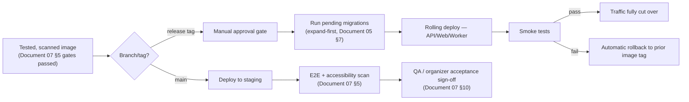

# 08 — Deployment and DevOps

**Document type:** Deployment and DevOps Runbook
**Audience:** DevOps engineers, backend engineers, on-call responders, technical reviewers
**Status:** Complete — derived from and traceable to the SRS and SDS
**Related documents:** [02 — Software Requirements Specification](02-software-requirements-specification.md) (source of the NFR-AVAIL, NFR-SCALE, and NFR-COMP requirements this document operationalizes) · [03 — Software Design Specification](03-software-design-specification.md), [Sections 6.1–6.3](03-software-design-specification.md#6-cross-cutting-design-concerns) (background jobs, caching, and storage this document deploys and monitors) and [Sections 8.1–8.3](03-software-design-specification.md#8-deployment-architecture) (the architectural input this document turns into operational configuration) · [05 — Database Design](05-database-design.md), [Section 7](05-database-design.md#7-migration-strategy) (the migration pattern this document's deploy sequence executes) · [07 — Testing and Quality Assurance](07-testing-and-quality-assurance.md), [Section 5](07-testing-and-quality-assurance.md#5-cicd-test-gate-pipeline) (the test gates this document's pipeline extends into an actual deploy)

---

## 1. Introduction

### 1.1 Purpose

This document specifies **how the Ethiopia Innovation Hub is built, deployed, operated, and recovered**: environment configuration, infrastructure-as-code, the CI/CD pipeline's deploy stage (beyond the test gates already specified in [Document 07](07-testing-and-quality-assurance.md)), monitoring and alerting, backup/disaster recovery, scaling policy, and the compliance operations that fulfill NFR-COMP-001 through NFR-COMP-003. This document introduces no new architecture — every decision here is the operational realization of the architecture already fixed in [Document 03, Sections 8.1–8.3](03-software-design-specification.md#8-deployment-architecture), per that document's own forward reference.

### 1.2 Scope

This document covers infrastructure provisioning and topology (Section 2), environment and secrets configuration (Section 3), the deployment pipeline and release process (Section 4), monitoring and observability (Section 5), backup and disaster recovery (Section 6), scaling policy (Section 7), incident response (Section 8), data residency and the hosting decision (Section 9), and compliance operations (Section 10). It does not cover what is tested before a deploy — that is [Document 07](07-testing-and-quality-assurance.md)'s scope — only what happens once a tested image is promoted.

### 1.3 Open item flagged for confirmation

[Document 02, NFR-COMP-003](02-software-requirements-specification.md#59-compliance) states that the specific hosting decision is documented here, and points to Document 01, Section 3 for the data-residency expectations that decision must satisfy. Document 01 was not available for cross-reference in this pass. Section 9 below documents a hosting recommendation consistent with the data-residency posture implied elsewhere in this series (an Ethiopia-focused platform under Ethiopia's Data Protection Proclamation, per NFR-COMP-001) — but it should be explicitly reconciled against Document 01, Section 3 before being treated as final, rather than assumed correct by inheritance from this document alone.

---

## 2. Infrastructure Topology

### 2.1 Production topology

This is the operational configuration of the container topology fixed in [Document 03, Section 8.1](03-software-design-specification.md#81-container-topology):

| Component | Deployment unit | Scaling | Notes |
|---|---|---|---|
| Nginx (reverse proxy, TLS termination) | Managed load balancer + Nginx container | Managed by cloud LB | Terminates TLS 1.2+ (NFR-SEC-001); origin traffic to the app tier is internal-network only. |
| Web (Next.js) | Docker container, N replicas | Horizontal, CPU/request-based | Stateless; serves both SSR and CSR bundles per [Document 03, Section 7.1](03-software-design-specification.md#71-structure). |
| API (Django) | Docker container, N replicas | Horizontal, CPU/request-based | Stateless (Document 03 §8.1); no session affinity required, consistent with ADR-002's stateless-JWT decision. |
| Celery Worker | Docker container, N replicas | Horizontal, **per-queue** (Section 7.2) | Separate replica pools per queue (`notifications`, `media`, `analytics`, `scheduled`) so a backlog in one queue cannot starve another — see [Document 03, Section 6.2](03-software-design-specification.md#62-caching-and-queue-design-redis). |
| Celery Beat | Docker container, **exactly 1 replica** | None — fixed at 1 | Enforced by deployment configuration (not just convention), since a second replica would duplicate every periodic job (Document 03 §8.1, ADR-003's accepted trade-off). |
| PostgreSQL | Managed service, primary + read replica | Vertical (managed); read replica for reporting/analytics read load | System of record (Document 05). |
| Redis | Managed cluster | Vertical (managed) | Three logical DBs per Document 03 §6.2. |
| S3-compatible object storage | Managed service | N/A (object storage) | Prefixes per Document 03 §6.3. |

### 2.2 Infrastructure as Code

All infrastructure (load balancer, container orchestration, managed database/cache/storage provisioning, DNS, TLS certificates) is defined declaratively (Terraform or equivalent) and version-controlled in the same repository family as the application, so that a given `staging` or `production` topology is reproducible from source rather than hand-configured. Infrastructure changes go through the same pull-request review as application code; a `terraform plan` (or equivalent) diff is a required artifact on any infrastructure PR before apply.

### 2.3 Container image strategy

One image per deployable component (`web`, `api`, `worker`; `beat` reuses the `api`/`worker` image with a different entrypoint rather than a fourth image, to minimize build surface). Images are tagged with the Git commit SHA, never `latest`, so that "the exact image tested in staging is the one deployed to production" (Document 03 §8.2) is enforceable by tag equality, not by trust.

---

## 3. Environment and Secrets Configuration

### 3.1 Environments

Reproduced from [Document 03, Section 8.2](03-software-design-specification.md#82-environments) with the operational detail that section deferred here:

| Environment | Infrastructure | Data | Access |
|---|---|---|---|
| `development` | Local Docker Compose | Seeded fixture data, reset freely | Individual developer machines |
| `staging` | Same topology as production, reduced instance sizes/replica counts | Synthetic multi-tenant data (multiple orgs/hackathons, per [Document 07, Section 3](07-testing-and-quality-assurance.md#3-test-environments-and-tooling)'s tenant-isolation test needs); never real participant PII | Engineering team, QA, and invited pilot Organizers for acceptance testing |
| `production` | Full topology (Section 2.1) | Real user data | Access restricted to on-call engineers via just-in-time elevated access, logged |

### 3.2 Configuration and secrets

- Non-secret configuration (feature flags, queue names, cache TTLs) is environment-variable-driven and stored alongside the IaC definitions per environment.
- Secrets (database credentials, Redis auth, object storage keys, JWT signing key, SMS/email gateway credentials, payment gateway credentials for `telebirr`/`cbe_birr`/`chapa`) are stored in a managed secrets manager, never committed to the repository or baked into an image layer, and are injected into containers at runtime.
- The JWT signing key (backing `token_version`-checked access tokens, Document 03 §4.1) is rotatable independently of a deploy; rotation invalidates all outstanding access tokens platform-wide and is treated as a Critical-severity-adjacent operational action requiring the same sign-off as an incident response action (Section 8).
- Secret values differ per environment; `staging` never holds a production credential for any external gateway (SMS, email, payment), using sandbox/test credentials instead, so a `staging` misconfiguration cannot cause a real-world side effect (e.g., a real SMS charge or a real payment gateway call).

---

## 4. Deployment Pipeline and Release Process

### 4.1 Pipeline (extends Document 07 §5)

Deployment picks up exactly where [Document 07, Section 5](07-testing-and-quality-assurance.md#5-cicd-test-gate-pipeline)'s test gates leave off:

### 4.2 Migration execution

Per [Document 05, Section 7](05-database-design.md#7-migration-strategy)'s expand/contract pattern, migrations run as a distinct step **before** the new application code is rolled out, not as part of container startup — so that a migration failure is caught and blocks the rollout before any replica serves traffic against a schema it doesn't expect. A destructive (contract-phase) migration only ships once the release that stopped reading the affected column/table has been running in production for at least one full release cycle, consistent with NFR-MAINT-003's no-breaking-change-without-a-version-bump guarantee at the API layer and its schema-layer equivalent here.

### 4.3 Rolling deploy and rollback

- API, Web, and Worker replicas are updated in a rolling fashion (old and new versions briefly coexist), which is safe specifically because the API is stateless (Document 03 §8.1) and every job is idempotent or safely retryable (Document 03 §6.1).
- Celery Beat, being single-replica, has a brief scheduling gap during its own replacement; this is accepted as a known limitation (consistent with ADR-003) rather than solved with a redundant scheduler, since the periodic jobs it triggers (deadline checks, reminders, analytics aggregation) tolerate a sub-minute gap without violating their governing NFRs.
- Rollback is image-tag-based: reverting to the immediately prior tag on smoke-test failure (Section 4.1) requires no rebuild, consistent with the image-based (not rebuild-based) promotion principle in Document 03 §8.2. A rollback that would require reverting an already-applied expand-phase migration is treated as an incident (Section 8), not a routine rollback, since the expand/contract pattern is specifically designed so this should not be necessary.

### 4.4 Release cadence and versioning

API versioning follows NFR-MAINT-003: a breaking change to a published endpoint ships under a new version path, never as a mutation of the existing one while it has active consumers. Application releases are not required to align with API version bumps — most releases ship no breaking API change.

---

## 5. Monitoring and Observability

Builds on the observability design already fixed in [Document 03, Section 6.6](03-software-design-specification.md#66-observability):

| Signal | Source | Consumer |
|---|---|---|
| Structured JSON logs, correlated by `correlation_id` (generated at Nginx, propagated through Celery job payloads) | API, Web, Worker containers | Log aggregation platform; used to trace a single user-facing request through every async job it triggers |
| Metrics: request latency, error rate, queue depth | Prometheus format, exported from API and Worker containers (Document 03 §6.6) | Prometheus + Grafana dashboards |
| Audit trail | `audit_log` table (Document 05, Section 4.11) | Platform Admin console (FR-ADMIN-001), queried directly — not a monitoring-stack concern |

### 5.1 Dashboards

- **Request performance:** p50/p95/p99 latency and error rate per endpoint, directly instrumenting NFR-PERF-001.
- **Queue health:** per-queue depth and job failure/retry rate (`notifications`, `media`, `analytics`, `scheduled`), instrumenting the isolation guarantee behind NFR-AVAIL-003.
- **Discovery cache:** hit rate on the Redis DB 1 discovery cache (Document 03 §6.2), a leading indicator for NFR-PERF-002 risk if hit rate drops.
- **Business dashboard (Organizer-facing):** FR-ANALYTICS-001/002 are application features, not part of this operational monitoring stack, but share the same metrics pipeline for the "registrations over time" chart's near-real-time update requirement.

### 5.2 Alerting

| Alert | Threshold | Maps to |
|---|---|---|
| API p95 latency | > 500ms sustained 5 min | NFR-PERF-001 |
| API error rate | > 1% sustained 5 min | General health |
| `notifications` queue depth | Sustained growth beyond a defined backlog threshold for 10 min | NFR-PERF-003 (60s email SLA at risk) |
| `send_sms_fallback` job dead-letter rate | Any sustained increase | NFR-AVAIL-003 — should page the SMS gateway dependency, not the platform on-call for unrelated escalation |
| Database replica lag | > 30s | Data-tier health, ahead of any read-replica-served analytics query going stale |
| Failed login rate (aggregate) | Anomalous spike | Possible credential-stuffing signal, feeds NFR-SEC-004's ongoing security posture |
| Certificate expiry | 14 days out | NFR-SEC-001 |

Alerts route to on-call per Section 8; alert thresholds are reviewed each time a related NFR's target changes in [Document 02](02-software-requirements-specification.md).

---

## 6. Backup and Disaster Recovery

Directly implements NFR-AVAIL-002:

| Parameter | Value | Mechanism |
|---|---|---|
| Backup frequency | At least every 24 hours | Managed PostgreSQL automated snapshot, plus continuous WAL archiving where the managed provider supports point-in-time recovery below the 24h floor |
| RPO (Recovery Point Objective) | 24 hours | Snapshot cadence above; PITR, where available, improves on this floor without being required by the NFR |
| RTO (Recovery Time Objective) | 4 hours | Restore procedure below, rehearsed per the drill cadence in Section 6.2 |
| Object storage | Versioned bucket with cross-region replication (where supported by the storage provider) | Protects submission media, avatars, and org verification documents (Document 03 §6.3) independently of the database backup |

### 6.1 Restore procedure

1. Provision a new PostgreSQL instance from the most recent snapshot (or PITR to the desired point).
2. Point a `staging`-topology stack at the restored instance to validate integrity before any production cutover.
3. Cut production traffic over via the same load-balancer/DNS mechanism used for a normal deploy (Section 4), not a bespoke path — minimizing untested recovery machinery.
4. Post-restore, reconcile any object-storage writes that occurred after the database snapshot but are now orphaned (e.g., a submission media upload whose `submission.attachment_urls` row didn't make it into the restored snapshot) via a reconciliation job before reopening general availability.

### 6.2 Restore drills

`TC-NFR-AVAIL-002` ([Document 07, Section 7.3](07-testing-and-quality-assurance.md#73-availability-and-reliability-nfr-avail-001--003)) is executed against `staging` on a recurring schedule (at minimum, before each production pilot and at a regular cadence thereafter), asserting both the RPO and RTO figures above are met in practice, not just documented as targets.

---

## 7. Scaling Policy

Directly implements NFR-SCALE-001 and NFR-SCALE-002.

### 7.1 Application tier (NFR-SCALE-001)

- API and Web replicas scale horizontally on a CPU-and-request-rate policy, with a minimum replica count sized to absorb the specific traffic pattern named in NFR-SCALE-001 — a national-scale hackathon's registration window opening — without a cold-start scaling lag causing user-visible failures at the moment registration opens. Organizers scheduling a registration open are a known, plannable traffic event; pre-scaling ahead of a known high-registration hackathon's opening is an operational runbook action, not solely reactive autoscaling.
- No schema migration is required to reach the 2,000-concurrent-user target (NFR-SCALE-001), since the stateless API/Web design (Document 03 §8.1) and row-level multi-tenancy (ADR-004) both scale by adding replicas, not by restructuring data.

### 7.2 Worker tier

Celery Workers scale per-queue (Section 2.1), so a burst in one job type (e.g., a wave of `send_transactional_email` jobs at a submission deadline) scales that queue's workers without affecting `analytics` or `media` queue capacity — the operational expression of the queue isolation designed in Document 03 §6.1/6.2.

### 7.3 Data tier (NFR-SCALE-002)

The 50,000-user, 500-concurrent-hackathon target is validated against the indexing strategy already specified in [Document 05, Section 5](05-database-design.md#5-indexing-strategy-summary), not re-derived here; this document's responsibility is ensuring the managed PostgreSQL instance is sized (CPU/memory/IOPS) with headroom against that target and that the read replica (Section 2.1) is available to absorb reporting/analytics read load without contending with write-path latency (NFR-PERF-001).

---

## 8. Incident Response

| Severity | Definition | Response |
|---|---|---|
| SEV-1 | Full outage, data loss, or a confirmed cross-tenant data exposure | Immediate page to on-call; incident channel opened; Section 6's restore procedure invoked if data-tier-related. |
| SEV-2 | A Must-Have flow degraded platform-wide (e.g., registration failing for all hackathons) but not a full outage | Paged within business-hours-equivalent response time; investigated same-shift. |
| SEV-3 | A single dependency degraded with isolation holding (e.g., SMS gateway down, per NFR-AVAIL-003, while email continues) | Tracked, not paged with the same urgency, since the isolation design means no other function is at risk. |

Every incident is retrospected with a written postmortem; where the root cause traces to a gap in Section 5's alerting or Section 6's backup coverage, the postmortem's corrective action is a change to this document, keeping it current with actual operational experience rather than static.

---

## 9. Data Residency and Hosting Decision

Per NFR-COMP-003 and the open item flagged in Section 1.3: production data is hosted in a region and under a hosting agreement intended to align with Ethiopia's Data Protection Proclamation (NFR-COMP-001) and this platform's Ethiopia-focused positioning (Ethiopian institutional email verification per FR-ORG-002, Ethiopian Birr and local payment gateways per Document 05 §4.10, Amharic localization per NFR-L10N-001). Two concrete options, to be finalized against Document 01, Section 3's residency expectations:

1. **In-country hosting**, if a compliant local data center or cloud provider with an Ethiopian presence is available and meets the platform's availability and managed-service requirements (Section 2).
2. **Nearest-compliant-region hosting** (e.g., a major cloud provider's closest region with a data processing agreement recognized as adequate under the Data Protection Proclamation), if no in-country option meets the technical bar, with data residency and cross-border transfer terms explicitly documented in the hosting agreement.

Whichever option is selected, the hosting agreement itself — not just the technical region setting — is the artifact that satisfies NFR-COMP-003, and should be retained alongside this document once finalized.

---

## 10. Compliance Operations

Operationalizes NFR-COMP-001 through NFR-COMP-003, which are documentation/process-verified per [Document 07, Section 7.7](07-testing-and-quality-assurance.md#77-compliance-nfr-comp-001--003) rather than automated-test-verified:

- **Lawful basis register (NFR-COMP-001):** a maintained document (outside this file) recording the lawful basis for each category of personal data collected (account profile, registration eligibility answers, verification documents, payment recipient data), reviewed whenever a new personal-data field is added to [Document 05](05-database-design.md)'s schema.
- **Data export/deletion fulfillment (NFR-COMP-002):** the "queued job, tracked outside this schema" referenced in [Document 05, Section 6](05-database-design.md#6-data-retention-and-anonymization-nfr-comp-002) is a Celery job (`process_data_deletion_request`, extending the job table in Document 03 §6.1) triggered from the Platform Admin console or a self-service settings action, executing the anonymization behavior specified there, with a due-date field enforcing the 30-day fulfillment window and an alert (Section 5.2 pattern) if a request approaches that window unfulfilled.
- **Hosting agreement (NFR-COMP-003):** Section 9.

---

## 11. Requirement Traceability

| Requirement | Section |
|---|---|
| NFR-PERF-001 – 004 | 5.1, 5.2, 7.1 |
| NFR-SEC-001 | 3.2 (TLS via secrets/config), 5.2 |
| NFR-SEC-004 | 4.1 (image scan gate is Document 07's; this document only deploys the scanned image) |
| NFR-AVAIL-001 | 5 (monitoring), 8 (incident response) |
| NFR-AVAIL-002 | 6 |
| NFR-AVAIL-003 | 2.1 (per-queue worker isolation), 5.2, 8 |
| NFR-SCALE-001 | 7.1 |
| NFR-SCALE-002 | 7.3 |
| NFR-MAINT-003 | 4.2, 4.4 |
| NFR-COMP-001 | 9, 10 |
| NFR-COMP-002 | 10 |
| NFR-COMP-003 | 9 |

---

*End of Document 08.*
